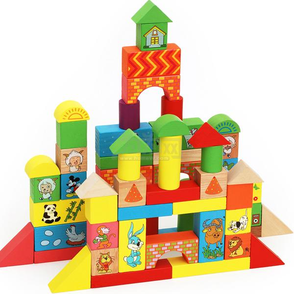
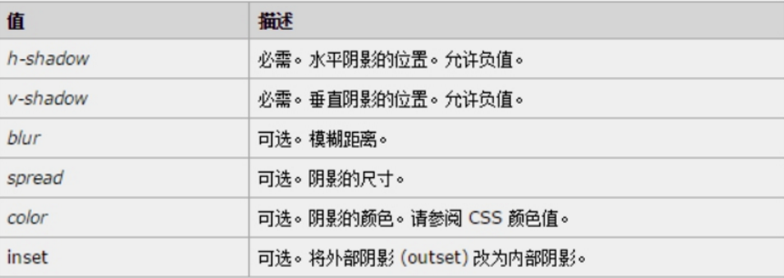
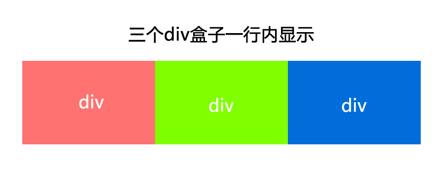

---
# 课程目标:
> 1. 学会使用CSS选择器
> 2. 熟记CSS样式和外观属性
> 3. 熟练掌握CSS各种选择器
> 4. 熟练掌握CSS各种选择器
> 5. 熟练掌握CSS三种显示模式
> 6. 熟练掌握CSS背景属性
> 7. 熟练掌握CSS三大特性
> 8. 熟练掌握CSS盒子模型
> 9. 熟练掌握CSS浮动
> 10.熟练掌握CSS定位
> 11.熟练掌握CSS高级技巧强化CSS
typora-copy-images-to: media
---

# 1、CSS定义

CSS： cascading style sheet(层叠样式表)


浏览器渲染（浏览器将具体渲染逻辑从HTML内容中剥离出来。）：


# 2、CSS发展历史

最初的web设计师使用视觉相关的标签 (如:u,i,B, BR)及属性 ，来进行页面的样式展示。


任何页面的修改都是一项很枯燥繁琐的工作，因为每个HTML页面都得需要修改。


# 3、CSS书写位置

CSS可以写到那个位置？ 是不是一定写到html文件里面呢？

## 内嵌样式表

内嵌式是将CSS代码集中写在HTML文档中，并且用style标签定义，其基本语法格式如下：

```html
<style>
    选择器 {属性1:属性值1; 属性2:属性值2; 属性3:属性值3;}
</style>
```

style标签一般位于head标签中title标签之后，

style标签一般放在body标签前面

## 行内样式

通过标签的style属性来设置元素的样式，其基本语法格式如下：

```html
<标签名 style="属性1:属性值1; 属性2:属性值2; 属性3:属性值3;"> 内容 </标签名>
```

语法中style是标签的属性，实际上任何HTML标签都拥有style属性，用来设置行内样式。

其中书写规范与CSS样式书写规则相同，行内样式只对其所在的标签起作用。


## 外链样式表（外链式）

将所有的样式放在一个或多个以.CSS为扩展名的外部样式表文件中，

通过link标签将外部样式表文件链接到HTML

文档中，其基本语法格式如下：

```html
<head>
    <title>网页标题</title>
    <link href="CSS文件的路径"  rel="stylesheet" />
</head>
```

注意：  link 是个单标签

该语法中，link标签需要放在head头部标签中，并且必须指定link标签的三个属性，具体如下：

```
href：定义所链接外部样式表文件的URL，可以是相对路径，也可以是绝对路径。

rel：定义当前文档与被链接文档之间的关系，在这里需要指定为“stylesheet”，表示被链接的文档是一个样式表文件。
```

## 三种样式表总结

| 样式表     | 优点                     | 缺点                     | 使用情况       | 控制范围           |
| ---------- | ------------------------ | ------------------------ | -------------- | ------------------ |
| 行内样式表 | 书写方便，权重高         | 没有实现样式和结构相分离 | 较少           | 控制一个标签（少） |
| 内嵌样式表 | 结构和样式相分离         | 没有彻底分离             | 较多           | 控制一个页面（中） |
| 外链样式表 | 完全实现结构和样式相分离 | 需要引入                 | 最多，强烈推荐 | 控制整个站点（多） |


练习：下列说法正确的是：（    ）

A：行内样式书写在<style></style> 标签内

B：内嵌样式实现了样式与结构的完全分离

C：外链样式通过meta 标签链入html文档中

D： CSS样式分为三种类型 ：行内样式、内嵌样式、外链样式

E：我们一般将CSS样式书写在style 属性当中

D：行内样式权重最高


# 4、CSS语法

HTML有语法，CSS同样又语法                                          


~~~
在上面的样式规则中:

1.选择器：定位目标元素。

2.属性名和属性值以“键值对”的形式出现。

3.属性名和属性值之间用英文“:”连接。

4.多个“键值对”之间用英文“;”进行区分。

~~~

例子：

```css
p {color: green}
使 <p> 标签中的文本内容采用绿色字体显示

p {text-align: center; color: green}
一起设置多个属性 (居中对齐，绿色字体)

h1,h2,h3,h4,h5,h6,p {text-align: center; color: green}
一起为多个标签设置相同的样式

```


# 5、CSS选择器（selector）

CSS 选择器的作用？

快速定位到要操作的目标元素


如上图所以，要把里面的小黄人分为2组，最快的方法怎办？  

很多， 比如 一只眼睛的一组，剩下的一组  

##  5-1、CSS基础选择器

### 5-1-1、通用选择器

```css
* 可以匹配所有元素

* {
	color: blue;
  } 

```

### 5-1-2、标签选择器

以标签名作为选择器

标签选择器会命中所有的对应标签

```html
HTML

<div>		  			
	Text					
</div>					
<div>					
	<span>some text </span>			
</div>				
<span>some other text </span>
```

```css
CSS

div {
    width: 200px;
}
span {
    font-size:130%;
}
```

### 5-1-3、类选择器

类选择器使用“.”（英文点号）进行标识，后面紧跟类名，其基本语法格式如下：

```html
HTML

<div class=“big red active”>		  
	Text						
</div>				
<div>
	<span class=“big”>some text </span>
</div>
<a href=http://www.abc.com/ class=“btn big”>to baidu!</a>
```

```css
CSS

.big{
    color:red
}
```

类选择器最大的优势是可以为元素对象定义相同的样式。 可以选择一个或者多个标签 


**类的命名**

~~~
1. 长名称 或 词组 可以使用中横线'-'来为类选择器命名。

   子类命名要取父元素的class名作为前缀（不是绝对的） 
   
   

  例如：淘宝导航  
  
  
  <div class='site-nav-bd'>
     <ul class='site-nav-bd-l'>
       <li class='site-nav-menu'>中国大陆</li>
       <li class='site-nav-menu'>手机淘宝</li>
       <li class='site-nav-menu'>消息</li>
     </ul>
     <ul class='site-nav-bd-r'>
       <li class='site-nav-menu'>收藏夹</li>
       <li class='site-nav-menu'>商品分类</li>
       <li class='site-nav-menu'>卖家中心</li>
     </ul>
  </div>
  
  
  
  
  site-nav-bd-l  :    site 网站
                      nav :navigation  导航
                      bd : board 面板
                      l:left
 英文单词缩写后用 '-' 链接                     
                  

2.不建议使用“_”下划线来命名CSS选择器。
   
   好处如下：
   
     输入的时候少按一个shift键;
　   
　   能良好区分JavaScript变量命名(JS变量命名是用“_”)

3.不要用 ：纯数字（英文和数字混合使用可以）、中文、拼音等命名， 尽量使用英文单词来表示，如果英文单词很

长，我们一般用它的简写形式。

4.id名称和class名称有可能作为检索值用在javascript代码中，所以命名要注意：

   a、类名中全部使用小写
   
   b、id名称的关键词用下划线（_）连接
   
   c、class的关键词用中划线(-)连接
   
   d、最大限度地保证命名的不重复
    
    site-nav-bd 、bd两个类名比较？
    
    site-nav-bd : 网站导航面板
    
    bd  : 面板
    
    bd 复用性强
    
    site-nav-bd 语义性更强
   
  
~~~

  类名常用的单词： 

```
  头：header
  内容：content/container
  尾：footer
  导航：nav
  侧栏：sidebar
  页面外围控制整体布局宽度：wrapper
  左右中：left right center
  登录：login
  标志：logo
  广告：banner
  页面主体：main
  热点：hot
  新闻：news
  下载：download
  子导航：sub-nav
  菜单：menu
  子菜单：sub-menu
  搜索：search
  页脚：footer
  版权：copyright
  滚动：scroll
  内容：content
  选项卡：tab
  文章列表：list
  提示信息：msg
  小技巧：tips
  栏目标题：title
  加入：join
  服务：service
  注册：regsiter
  状态：status
  投票：vote
  合作伙伴：partner

  注释的写法:
  /* Footer */
  内容区
  /* End Footer */
```

注意：命名是我们通俗约定的，但是没有规定必须用这些常用的命名。

课堂案例：

 


~~~html
<head>
        <meta charset="utf-8">
        <style>
        /*
            后代选择器
            公共的样式单独拎出来
            */
         
        /*
            CSS 代码性能 ？
            
            网页解析CSS的速度
            
            解析CSS代码哪部分最耗时？
            
            定位目标元素的过程（解析选择器的过程）            
            
            CSS 代码中最常用的选择器是什么？后代选择器
            
            后代选择器由类选择器、标签选择器、id选择器等基础选择器构成            
            
            网页解析 后代选择器 的顺序是从右到左的！！！！！！！！！
            
            .google span {}             
           
            
            从右到左： 先找到所有的span ，然后找到拥有google父类的span        
            
            
            */    
            
        .google .google-item {
        	font-size: 100px;
        }
            
            
       .google .google-g1{
                color: blue;
        }
       .google .google-o1{
          color: orange;
        }  
        .google .google-o2{
          color: green;
        }  
        .google .google-g2{
            color: blue;
        }   
        .google .google-l{
            color: green;
        }
         .google .google-e{
            color: red;
        }
      
        </style>
    </head>
    <body>
        <!--span.blue{G}-->
        <div class='google'>
            <span class="google-item google-g1">G</span>
            <span class="google-item google-o1">o</span>
            <span class="google-item google-o2">o</span>
            <span class="google-item google-g2">g</span>
            <span class="google-item google-l">l</span>
            <span class="google-item google-e">e</span>
        </div>    	
    </body>
~~~


我们可以给标签指定多个类名，类的复用性变高了


注意：

~~~
1. 样式显示效果跟HTML元素中的类名先后顺序没有关系,受CSS样式书写的上下顺序有关。

<style>
.box2{
    color:red
}
.box1{
    color:green
}
</style>
<!-- 
   显示绿色
   浏览器自上而下读取页面
-->
<div class='box1 box2'>div</div>


2. 各个类名中间用空格隔开。

3.经常使用多个类名。

4.能用类选择器就不用标签选择器和id选择器（针对写css样式而言）

5.最常用的选择器： 类选择器、后代选择器、标签选择器（少用）

标签选择器少用？

div span a 等都是标签选择器

标签选择器覆盖范围最广

使用过多的标签选择器，浏览器解析CSS的速度变慢了

一个页面当中可能有100个div，

一个页面中可能只有几个拥有类名是 nav-l 的div

遍历（一个一个拿出来看）的元素越多，计算速度越慢

id 选择器的解析速度最快，但是复用性不强

* 选择器解析速度最慢，最好不要使用

最好使用类选择器，解析速度快，复用性强

div{
    color:red
}

.nav-l{
    color:red
}

~~~

### 5-1-4、id选择器

id选择器使用“#”进行标识，后面紧跟id名，元素的id值是唯一的，只能对应

于文档中某一个具体的元素。其基本语法格式如下：

```html
<div id=“content”>	 
	Text					
</div>	
<!--
页面当中不可能有两个相同的id值

样式写在id选择器当中的劣势？

样式不能够被复用
-->
<p id='content'>
    p
</p>
```

```css
#content {
    width:200px;
}
```


**id选择器和类选择器区别**

W3C标准规定，在同一个页面内，不允许有相同名字的id标签出现，

但是允许相同名字的class。

类选择器（class） 好比人的名字，  是可以多次重复使用的

id选择器     好比人的身份证号码，  全中国是唯一的， 不得重复。 只能使用一次。

***id选择器和类选择器最大的不同在于 使用次数上。***


CSS选择器练习：

```html
  <div class='site-nav-bd'>
     <ul class='site-nav-bd-l'>
       <li class='site-nav-menu'>中国大陆</li>
       <li class='site-nav-menu'>手机淘宝</li>
       <li class='site-nav-menu'>消息</li>
     </ul>
     <ul class='site-nav-bd-r'>
       <li class='site-nav-menu'>收藏夹</li>
       <li class='site-nav-menu'>商品分类</li>
       <li class='site-nav-menu'>卖家中心</li>
     </ul>
  </div>

CSS

1、所有文字变成红色
2、中国大陆、手机淘宝、消息 字体大小设置成 100px
3、收藏夹、商品分类、卖家中心 字体大小设置成 200px
4、中国大陆添加；绿色背景

div.site-nav-bd>div.site-nav-bd-l+div.site-nav-bd-r

div.site-nav-menu*3

<style>
    /*
      样式书写顺序 ： 先写父类、再写子类、最后写孙子类（从大到小写）
    */
    .site-nav-bd {
        /* 文字样式（颜色、字体大小、字体类型）可以被 继承 */
        color: red
    }
    
    .site-nav-bd .site-nav-bd-l {
        font-size: 100px
    }
    
    .site-nav-bd .site-nav-bd-r {
        font-size: 200px
    }
    
    .site-nav-bd .site-nav-menu-china {
        background-color: green
    }
</style>

```


## 5-2、CSS复合选择器


复合选择器是由两个或多个基础选择器，通过不同的方式组合而成的,

目的是为了可以选择更准确更精细的目标元素标签。

### 5-2-1 、交叉选择器

交集选择器由两个选择器构成，其中第一个为标签选择器，第二个为class选择器或id选择器，

两个选择器之间不能有空格（有空格就变成了后代选择器）


**记忆技巧：**

交叉选择器 是 并且的意思。  即...又...的意思

```
比如：   p.one   选择的是： 类名为 .one  的 段落标签。  
```

用的相对来说比较少，不太建议使用。

### 5-2-2、群组选择器

多个选择器可以合并为一组，共享同一个样式表，中间使用 逗号 “,” 隔开 .


### 5-2-3、后代选择器

后代选择器又称为包含选择器，用来选择元素的后代，

```html
<div class=“a”> 			
    <p> Hello there! </p>
    <p class='b'> Hi, I am here! </p>
</div>
<p> welcome to dingyuanjiaoyu!</p>
```

```css
其写法就是把外层标签写在前面，内层标签写在后面，中间用 ‘空格’ 分隔。

.a .b{
    font-size:20px;
}
```

### 5-2-4、父子选择器

父子选择器：只能选择作为某元素的直接子元素。其写法就是把父级标签写在前面，子级标签写在后面，中

间跟一个  ‘&gt; ’ 进行连接


白话：  这里的子 指的是 亲儿子  不包含孙子 重孙子之类。

```
 比如：  .demo > h3 {color: red;}   说明  h3 一定是demo 亲儿子。  demo 元素包含着h3。

```


**测试题**

```html
<style>
    /*
1. '登录'的颜色为红色,同时主导航栏里面的所有的链接改为黄色 。
2. 主导航栏和侧导航栏里面文字都是14像素并且是微软雅黑。
3. 主导航栏里面的一级菜单链接文字颜色为绿色。 
*/
    /* 
      字体颜色能继承（文本相关的样式都能够继承）

      a 标签内的文本不会继承父元素的颜色    

      打我们选择标签吃力的时候，可以为标签添加类名

      后代选择器，没必要每层嵌套都写进去，抓主要的例如：

      后代选择器不要超过三层（维护不方面，浏览器解析不方便）

        .nav .main-nav-menu>li>a {
          color: green
        }
     */
  
    
    .side-nav .side-nav-r>a {
        color: red
    }
    
    .nav a {
        color: yellow
    }
    
    .nav {
        font-size: 14px;
        font-family: 'Microsoft Yahei'
    }
    
    .nav .main-nav-menu>li>a {
        color: green
    }
</style>

<body>
    <div class="nav"><!-- 导航 -->
        <div class="main-nav"><!-- 主导航栏 -->      
            <ul class="main-nav-menu">
                <li class="main-nav-menu-item"><a href="#">公司首页</a></li>
                <li class="main-nav-menu-item"><a href="#">公司简介</a></li>
                <li class="main-nav-menu-item"><a href="#">公司产品</a></li>
                <li class="main-nav-menu-item">
                    <a href="#">联系我们</a>
                    <ul>
                        <li><a href="#">公司邮箱</a></li>
                        <li><a href="#">公司电话</a></li>
                    </ul>
                </li>
            </ul>
        </div>
        <div class="side-nav"><!-- 侧导航栏 -->            
            <div class="side-nav-l">左侧侧导航栏</div>
            <div class="side-nav-r"><a href="#">登录</a></div>
        </div>
    </div>
</body>
```

### 5-2-5、伪类选择器

```html
快捷键  p.nav>a.nav-link*5
    
<p class="nav">
    <a href="" class="nav-link"></a>
    <a href="" class="nav-link"></a>
    <a href="" class="nav-link"></a>
    <a href="" class="nav-link"></a>
    <a href="" class="nav-link"></a>
</p>
```

伪类选择器用于向某些元素添加特殊的效果。

- :link      /* 未访问的链接 */
- :visited   /* 已访问的链接 */
- :hover     /* 鼠标移动到链接上 */
- :active    /* 选定的链接 */

   注意写的时候，他们的顺序尽量不要颠倒  按照  lvha 的顺序。   love   hate  爱上了讨厌 记忆法    或者   lv 包包 非常 hao 

```css
a {   /* a是标签选择器  所有的链接 */
        font-weight: 700;
        font-size: 16px;
        color: gray;
}
a:hover {   /* :hover 是链接伪类选择器 鼠标经过 */
			color: red; /*  鼠标经过的时候，由原来的 灰色 变成了红色 */
}
```

### 5-2-6、相邻选择器

用 ‘+’ 表示，选择下一个紧邻的兄弟元素

```html
.abc + p {
	font-weight: bold;
}
 
<div>
	<div class=“abc”>Message</div>
	<p>Hello there!</p> <!--加粗-->
	<p>Hello here!</p>
</div>

```

### 5-2-7、兄弟选择器

```html
E~F ：选择E元素后面的所有兄弟元素F。 

与相邻选择符不同的是，兄弟选择符会命中所有符合条件的兄弟元素，而不强制是紧邻的元素。

.abc~p{
  color:red
}

<div>
	<div class=“abc”>Message</div>
	<p>Hello there!</p> <!--变红-->
	<p>Hello here!</p> <!--变红-->
    <p>Hello dear!</p> <!--变红-->
    <p>Hello xiaokeai!</p> <!--变红-->
</div>

```

### 5-2-8、属性选择器

```css
E[alt] ：选择具有alt属性的E元素。

E[alt='val']：选择具有alt属性且属性值等于val的E元素。 

例如：img[alt] 、input[type='text']

E[alt^="val"]选择具有alt属性且属性值为以val开头的E元素。

E[alt$="val"]选择具有alt属性且属性值为以val结尾的E元素。

E[alt*="val"] 选择具有alt属性且属性值为包含val的E元素。
```

### 5-2-9、选择器总结

常用的选择器（重要性依次递减）： 后代选择器 、类选择器 、标签选择器、 群组选择器

后代选择器最好不要超过三层

选择器命名很巧妙很重要


## 5-3、CSS选择器权重


选择器的权重？有叫做选择器的优先级

选择器的权重越高，选择器的样式就会优先显示

```html
<div class='box' id='container' style='color:red'>
    box 
</div>

<style>
    /*
      行内样式的权重最高
    
      id 选择器 的权重要高于 类选择器
    
      box 文本颜色最终为 红色
    */
    .box{
        color:green
    }
    #box{
        color:yellow
    }
</style>

```


### 5-3-1、html 样式表分类

1、用户样式表（user agent stylesheet）----》 浏览器自带（ 例如 body{ display:block; margin : 8px } ）

2、作者样式表 (Author style sheet)（包括行内样式inline、内嵌样式、外链样式external）---->网站开发者写的

样式表


**用户样式表** 和 **作者样式表**哪个权重高？

作者样式表权重高！！！

网站开发者写的样式表会高于浏览器自带的样式表


### 5-3-2、选择器级别


选择器权重比较一下

很多选择器？？

选择器先分级

分几级？浏览器对选择器分了4级

分级的目的？ 方便比较选择器的权重高低


分级，四级

不分级，8级


第一级（a）：行内样式


第二级（b）: id


第三级（c）: 类、属性([])、伪类（:hover）


第四级（d）: 标签、伪元素


### 5-3-3、选择器打分


打分的目的 ？分数决定了选择器的权重，打完分，权重就好判断了

打分规则？

分数分成四级 ：A、B、C、D

A：行内

B：id

C: 类、属性、伪类

D：标签、伪元素

分数的级别和选择器级别一一对应

A 级 永远大于 B 级

B级 永远大于 C 级

C级 永远大于 D 级


例如 ： 

```css
.nav span{
    
}
打分 ： 0  0 1 1 

#nav .nav-item{
    
}
打分 ： 0 1 1 0

很明显 ： 0 0 1 1 分数 低于 0 1 1 0

因为：

A 级 永远大于 B 级

B级 永远大于 C 级

C级 永远大于 D 级


```


**！important**

作者可以向任何样式表(包括外链样式表)里面添加!important；添加了!important的

样式声明优先级高于没有添加的, 如果都有！important 怎么办？(行内>内联>外联)


# 6、CSS字体样式

## 6-1、font-size:字号大小

font-size 属性用于设置字号，该属性的值可以使用`相对长度单位`，也可以使用`绝对长度单位`。其中，相对长度单位比较常用，推荐使用像素单位px，绝对长度单位使用较少。具体如下：


## 6-2、font-family:字体类型


font-family 用于设置字体类型。网页中常用的字体有宋体、微软雅黑、黑体等，例如将网页中所有段落文本

的字体设置为微软雅黑，可以使用如下CSS样式代码：

```css
p{ font-family:"微软雅黑";}
```

可以同时指定多个字体，中间以逗号隔开，表示如果浏览器不支持第一个字体，则会尝试下一个，直到找到合适的字体。

```css
font: 12px/20px "SimSun","宋体","Arial Narrow",HELVETICA;
```

> 常用技巧：

```
1. 现在网页中普遍使用14px。

2. 尽量使用偶数的数字字号。

3. 各种字体之间必须使用英文状态下的逗号隔开。

4. 中文字体需要加英文状态下的引号，英文字体一般不需要加引号。

5. 如果字体名中包含空格、#、$等符号，则该字体必须加英文状态下的单引号或双引号，

6. 尽量使用系统默认字体，保证在任何用户的浏览器中都能正确显示。
```


## 6-3、CSS Unicode字体

在 CSS 中设置字体名称，直接写中文是可以的。但是在文件编码（GB2312、UTF-8 等）不匹配时会产生乱码的错

误。xp 系统不支持 类似微软雅黑的中文。

```css
font-family:'微软雅黑'   ------> xp 系统不支持

font-family:'Microsoft Yahei' -----> xp 系统支持

font-family: "\5FAE\8F6F\96C5\9ED1"  -----> xp系统支持
```

方案一： 你可以使用英文来替代。 比如 font-family:"Microsoft Yahei"。

方案二： 在 CSS 直接使用 Unicode 编码来写字体名称可以避免这些错误。使用 Unicode 写中文字体名称，浏览

器是可以正确的解析的。

font-family: "\5FAE\8F6F\96C5\9ED1"，表示设置字体为“微软雅黑”。


| 字体名称      | 英文名称            | Unicode 编码           |
| --------- | --------------- | -------------------- |
| 宋体        | SimSun          | \5B8B\4F53           |
| 新宋体       | NSimSun         | \65B0\5B8B\4F53      |
| 黑体        | SimHei          | \9ED1\4F53           |
| 微软雅黑      | Microsoft YaHei | \5FAE\8F6F\96C5\9ED1 |
| 楷体_GB2312 | KaiTi_GB2312    | \6977\4F53_GB2312    |
| 隶书        | LiSu            | \96B6\4E66           |
| 幼园        | YouYuan         | \5E7C\5706           |
| 华文细黑      | STXihei         | \534E\6587\7EC6\9ED1 |
| 细明体       | MingLiU         | \7EC6\660E\4F53      |
| 新细明体      | PMingLiU        | \65B0\7EC6\660E\4F53 |

为了照顾不同电脑的字体安装问题，我们尽量只使用宋体和微软雅黑中文字体


## 6-4、font-weight:字体粗细

字体加粗除了用 b  和 strong 标签之外，可以使用CSS 来实现，但是CSS 是没有语义的。

```html
font-weight 的属性值可以是英文单词，也可以是数字

font-weight属性用于定义字体的粗细，其可用属性值：normal、bold、bolder、lighter、100~900（100的整

数倍）。
```


小技巧： 

```css
数字 400 等价于 normal，而 700 等价于 bold。  但是我们更喜欢用数字来表示。  
```


## 6-5、font-style:字体风格

字体倾斜除了用 i  和 em 标签之外，可以使用CSS 来实现，但是CSS 是没有语义的。

font-style 属性用于定义字体风格，如设置斜体或正常字体，其可用属性值如下：

normal：默认值，浏览器会显示标准的字体样式。

italic：浏览器会显示斜体的字体样式。

oblique：浏览器会显示倾斜的字体样式。

小技巧： 

```css
平时我们很少给文字加斜体，反而喜欢把斜体标签（em，i）改为普通模式。

<span>
     <i>今天</i>
     <em>星期五</em>
</span>

i,em{
    font-style:normal
}
```


## 6-6、font:综合设置字体样式 (重点)

font属性用于对字体样式进行综合设置，其基本语法格式如下：

```css
选择器{font: font-style  font-weight  font-size/line-height  font-family;}

使用font属性时，必须按上面语法格式中的顺序书写，不能更换顺序，各个属性以空格隔开。

注意：其中不需要设置的属性可以省略（取默认值），但必须保留font-size和font-family属性，否则font属性将

不起作用。

例如淘宝的字体样式如下：

font: 12px/1.5  tahoma,arial,'Hiragino Sans GB','\5b8b\4f53',sans-serif

字体大小/行高

12px/1.5 不仅设置了字体大小，还设置了行间距（1.5表示1.5倍字体大小）

font 属性一般给html或者body设置一次就可以了，因为字体是可以继承的

```


# 7、CSS文本属性

## 7-1、color:文本颜色

color属性用于定义文本的颜色，其取值方式有如下3种：

1.英文，如red，green，blue等。

2.十六进制，如#FF0000，#FF6600，#29D794等。实际工作中，十六进制是最常用的定义颜色的方式。

```
十进制: 0、1、2、3、4、5、6、7、8、9

二进制: 0、1

十六进制 : 0、1、2、3、4、5、6、7、8、9、a、b、c、d、e、f（ f代表16 ）

```

3. RGB代码，如红色可以表示为rgb(255,0,0)


## 7-2、line-height:行间距（行高）


## 7-3、text-align:水平对齐方式

```
text-align 属性用于设置文本内容的水平对齐,其可用属性值如下：
```

left：左对齐（默认值）

right：右对齐

center：居中对齐

```html
<style>
    p {
        text-align: center;
        line-height: 30px;
        font-size: 0;
    }
    
    a {
        text-decoration: none;
        color: #000;
    }
    
    .nav-link {
        /* 将元素转化成行内块 */
        display: inline-block;
        width: 100px;
        height: 30px;
        background-color: red;
        font-size: 14px;
    }
    /* 
       text-align 设置在父盒子上面
       text-align 能够让标签里面的文本居中
       text-align 能够让所有的行内元素居中
       text-algin 能够继承，想要居中的话，为父盒子设置 text-align:center 就行了

       盒子内的文本如何才能垂直居中？盒子的高度 === 行高

       行高也能继承

       text-align 和 line-height 都能被子元素继承

       text-align 和 line-height 一般为父元素设置  

       行内块默认彼此存在间距

       如何去除，行内块之间的间距？

       给父元素设置，font-size:0 (子元素重新设置font-size)
     
     */
</style>

<body>
    <p>
        <a class="nav-link" href="">新闻</a>
        <a class="nav-link" href="">新闻</a>
        <a class="nav-link" href="">新闻</a>
        <a class="nav-link" href="">新闻</a>
        <a class="nav-link" href="">新闻</a>
    </p>
</body>
```

## 7-4、text-indent:首行缩进

text-indent属性用于设置首行文本的缩进，

其属性值 : px em rem %

## 7-5、text-decoration 文本的装饰

text-decoration   通常我们用于给`链接`修改装饰效果

| 值           | 描述                                          |
| ------------ | --------------------------------------------- |
| none         | 默认。定义标准的文本。                        |
| underline    | 定义文本下的一条线。下划线 也是我们链接自带的 |
| overline     | 定义文本上的一条线。                          |
| line-through | 定义穿过文本下的一条线。                      |

# 8、开发者工具（chrome）


1. ctrl+滚轮 可以 放大开发者工具代码大小。
2. 


# 9、CSS注释

## CSS 注释作用？

对CSS样式起到解释说明的作用，提高CSS 代码的可读性

## CSS 注释类型

```
CSS规则是使用     
/*  需要注释的内容  */  

进行注释的，即在需要注释的内容前使用 “/*” 标记开始注释，在内容的结尾使用 “*/”结束。
```


1、文件头部的文件信息注释

```css
/*
* reader content v1.0
* 
* Copyright 2013
* Dual licensed under the MIT or GPL Version 2 licenses.
*
* Designed and built by wangzheng 
* 
*/
```

Copyright : 版权、著作权

世界上的开源许可证，大概有上百种。很少有人搞得清楚它们的区别。即使在最流行的六种----

[GPL](http://www.gnu.org/licenses/gpl.html)、[BSD](http://en.wikipedia.org/wiki/BSD_licenses)、[MIT](http://en.wikipedia.org/wiki/MIT_License)、[Mozilla](http://www.mozilla.org/MPL/)、[Apache](http://www.apache.org/licenses/LICENSE-2.0)和[LGPL](http://www.gnu.org/copyleft/lesser.html)----之中做选择，也很复杂。

乌克兰程序员[Paul Bagwell](http://pbagwl.com/post/5078147450/description-of-popular-software-licenses)，画了一张分析图，说明应该怎么选择。这是我见过的最简单的讲解，

只用两分钟，你就能搞清楚这六种许可证之间的最大区别。


2、正文中的解释说明注释

   例如：

~~~css
/*reader header*/
.reader-header{
    
}
.reader-header-title{
    
}
.reader-header-introduce{
    
}
/*reader footer*/
.reader-footer{
    
}
.reader-footer-copyright{
    
}
.reader-footer-links{
    
}
~~~


# 10、快捷方式

快速提高我们代码的书写方式

1. 生成标签 直接输入标签名 按tab键即可   比如  div   然后tab 键， 就可以生成 <div></div>

2. 如果想要生成多个相同标签  加上 * 就可以了 比如   div*3  就可以快速生成3个div

3. 如果有父子级关系的标签，可以用 >  比如   ul > li就可以了

4. 如果有兄弟关系的标签，用  +  就可以了 比如 div+p  

5. 如果生成带有类名或者id名字的，  直接写  div.demo  或者  div#two   tab 键就可以了

   ```html
   例子：
   
   1、  div>p{$}*3+div.nav
   
       <div>
           <p>1</p>
           <p>2</p>
           <p>3</p>
           <div class="nav"></div>
       </div>
   
   2、 ul.nav>li.nav-item*3>a.nav-link
   
       <ul class="nav">
           <li class="nav-item">
               <a href="" class="nav-link"></a>
           </li>
           <li class="nav-item">
               <a href="" class="nav-link"></a>
           </li>
           <li class="nav-item">
               <a href="" class="nav-link"></a>
           </li>
       </ul>
   
   ```


# 11、标签显示模式（display）


```
display 属性值： 
    
     inline-block:将元素转换成行内块元素
    
     inline：将元素转换成行内元素
    
     block：将元素转换成块元素
    
     none：隐藏元素

行内元素和块元素区别？
    
     1、行内元素不独占一行、块元素独占一行

     2、行内元素不支持宽高（行内元素宽高是被自身文本撑起来的）、块元素支持宽高

行内元素和行内块元素区别？

     1、行内块元素支持宽高、行内元素不支持

     2、行内元素和行内块都不独占一行

     3、行内块元素之间有间隙（为父元素设置font-size：0 可以去除间隙）
     
display: none 和  visiablity : hidden 的区别与联系 ？

     二者都会隐藏元素，但是 display: none 不占位
```


# 12、CSS书写规范

开始就形成良好的书写规范，是你专业化的开始。

## 空格规范

【强制】 选择器 与 { 之间必须包含空格。

示例： .selector { }

【强制】 属性名 与之后的 : 之间不允许包含空格， : 与 属性值 之间必须包含空格。

示例：

font-size: 12px;

## 选择器规范

【强制】 当一个 rule 包含多个 selector 时，每个选择器声明必须独占一行。

示例：

```
/* good */

.post,
.page,
.comment {
   line-height: 1.5;
}


/* bad */

.post, .page, .comment {
    line-height: 1.5;
}
```

【建议】 选择器的嵌套层级应不大于 3 级，位置靠后的限定条件应尽可能精确。

示例：

```
/* good */
#username input {}
.comment .avatar {}

/* bad */
.page .header .login #username input {}
.comment div * {}
```

## 属性规范

【强制】 属性定义必须另起一行。

示例：

```
/* good */
.selector {
    margin: 0;
    padding: 0;
}

/* bad */
.selector { margin: 0; padding: 0; }
```

【强制】 属性定义后必须以分号结尾。

示例：

```
/* good */
.selector {
    margin: 0;
}

/* bad */
.selector {
    margin: 0
}
```

# CSS 两大特性

层叠  继承是我们学习CSS 必须掌握的两个特性。


## CSS层叠性

所谓层叠性是指多种CSS样式的叠加。

是浏览器处理冲突的一个能力,如果一个属性通过两个相同选择器设置到同一个元素上，那么这个时候一个属性就

会将另一个属性层叠掉

比如先给某个标签指定了内部文字颜色为红色，接着又指定了颜色为蓝色，此时出现一个标签指定了相同样式不同

值的情况，这就是样式冲突。

一般情况下，如果出现样式冲突，则会按照CSS书写的顺序，以最后的样式为准。

1. 样式冲突，遵循的原则是就近原则。 哪个样式离着结构近，就执行那个样式。
2. 样式不冲突，不会层叠

```
CSS最后的执行口诀：  长江后浪推前浪，前浪死在沙滩上。
```


## CSS继承性

所谓继承性是指书写CSS样式表时，子标签会继承父标签的某些样式，如文本颜色和字号。

```
CSS最后的执行口诀：  龙生龙，凤生凤，老鼠生的孩子会打洞。
```


注意：

```
恰当地使用继承可以简化代码，降低CSS样式的复杂性。

子元素可以继承父元素的样式（text-，font-，line- 这些开头的都可以继承，以及color属性）
```


# CSS 背景(background)

CSS 可以添加背景颜色和背景图片，以及来进行图片设置。

| background-color                                             | 背景颜色         |
| ------------------------------------------------------------ | ---------------- |
| background-image                                             | 背景图片地址     |
| background-repeat                                            | 是否平铺         |
| background-position                                          | 背景位置         |
| background-attachment                                        | 背景固定还是滚动 |
| background-size                                              | 背景图片大小     |
| background（复合属性）:背景颜色 背景图片地址 背景平铺 背景滚动 背景位置 |                  |


## 背景图片(image)

语法： 

~~~css
background-image : none | url (url) 
~~~

参数： 

none : 　无背景图（默认的）
url : 　使用绝对或相对地址指定背景图像 

## 背景平铺（repeat）

语法： 

~~~css
background-repeat : repeat | no-repeat | repeat-x | repeat-y 
~~~

参数： 

repeat : 　背景图像在纵向和横向上平铺（默认的）

no-repeat : 　背景图像不平铺

repeat-x : 　背景图像在横向上平铺

repeat-y : 　背景图像在纵向平铺 

设置背景图片时，默认把图片在水平和垂直方向平铺以铺满整个元素。

## 背景位置(position)

语法： 

~~~css
background-position : length || length

background-position : position || position 
~~~

参数： 

length : 　百分数 | px
position : 　top | center | bottom | left | center | right 


注意：

1. position 后面是x坐标和y坐标。 可以使用方位名词或者 精确单位。
2. 如果和精确单位和方位名字混合使用，则必须是x坐标在前，y坐标后面。比如 background-position: 15px top;   则 15px 一定是  x坐标   top是 y坐标。


## 背景附着

语法： 

~~~css
background-attachment : scroll | fixed 
~~~

参数： 

scroll : 　背景图像是随盒子滚动
fixed : 　背景图像不跟随盒子滚动


## 背景简写

background属性的值的书写顺序官方并没有强制标准的。为了可读性，建议大家如下写：

background:背景颜色 背景图片地址 背景平铺 背景滚动 背景位置

~~~css
background: transparent url(image.jpg) repeat-y  scroll 50% 0 ;
~~~

## 背景透明(CSS3)

CSS3支持背景半透明的写法语法格式是:

~~~css
background: rgba(0,0,0,0.3);
~~~

 最后一个参数是透明度  取值范围 0~1之间

 注意：  背景半透明是指盒子背景半透明， 盒子里面的内容不收影响。


# 盒模型（CSS重点）


其实，CSS就三个大模块：  盒模型 、 浮动 、 定位，其余的都是细节。这三部分，无论如何也要学的非常精通。  

所谓盒模型就是把HTML页面中的元素看作是一个矩形的盒子，也就是一个盛装内容的容器。每个矩形都由元素

的内容、内填充（padding）、边框（border）和外边距（margin）组成。

## 看透网页布局的本质

网页布局中，我们是如何把里面的文字，图片，按照美工给我们的效果图排列的整齐有序呢？


CSS 其实没有太多逻辑可言 ， 类似我们小时候玩的积木,我们可以自由的，随意的摆放出我们想要的效果。



## 盒子模型（Box Model）

首先，我们来看一张图，来体会下什么是盒子模型。


所有的文档元素（标签）都会生成一个矩形框，它描述了一个文档元素在网页

布局所占的位置大小。因此，<strong style="color: #f00;">每个盒子除了有自己大小和位置外，还影响着其他盒子的大小和位置。</strong>


## 盒子边框（border）

```
三要素：

边框宽度	border-width：像素值  

边框样式	border-style：常见的solid（实线）、dashed（虚线）、dotted（点线）、none 默认值 、double（双线）   

边框颜色	border-color:英文单词/十六进制代码

按方向：

上边框：border-top:
下边框：border-bottom:
左边框：border-left:
右边框：border-right:

边框复合属性： 

border ：border-width  border-style  border-color；

border-top : border-width  border-style  border-color
```


表格边框合并

```css
table{  
   border-collapse:collapse; 
}  
```


圆角边框(CSS3)

从此以后，我们的世界不只有矩形。radius 半径（距离）

语法格式：

~~~css
 border-radius: 1px 2px 3px 4px;

border-radius:50% ;(将盒子变成圆形)
~~~


## 内边填充（padding）

padding属性用于设置内边距。  是指 边框与内容之间的距离。


padding-top:上内边距

padding-right:右内边距

padding-bottom:下内边距

padding-left:左内边距

 注意：  后面跟几个数值表示的意思是不一样的。

| 值的个数 | 表达意思                                     |
| ---- | ---------------------------------------- |
| 1个值  | padding：上下左右边距 比如padding: 3px; 表示上下左右都是3像素 |
| 2个值  | padding: 上下边距 左右边距 比如 padding: 3px 5px; 表示 上下3像素 左右 5像素 |
| 3个值  | padding：上边距 左右边距 下边距 比如 padding: 3px 5px 10px; 表示 上是3像素 左右是5像素 下是10像素 |
| 4个值  | padding:上内边距 右内边距 下内边距 左内边距 比如: padding: 3px 5px 10px 15px; 表示 上3px 右是5px 下 10px 左15px 顺时针 |


## 外边距（margin）

### 简介

标签与标签之间的距离称为边距（margin）

上边距：margin-top     

下边距：margin-bottom   

左边距：margin-left   

右边距：margin-right   

行内元素上下边距无效

外边距和内填充的作用

### 复合属性：
​	margin：像素值（四个边距）
​	margin：像素值（上下）  像素值（左右）
​	margin：像素值（上）    像素值（左右）  像素值（下）
​        margin：像素值（上） 像素值（右） 像素值（下） 像素值（左）（顺时针方向） 

### 外边距折叠

​    当2个**垂直关系**的外边距相**接触**时，他们将叠加形成一个新的外边距。这个新形成的外边距，其高度为2个外

边距高度较大的那个。

外边距叠加出现的场合：

1、2个或多个块元素，一个放在另一个之上。


2、或者，当一个块元素包裹在另一个块元素之内时。


### 居中


分类： 水平居中、垂直居中

#### 水平居中

块状元素水平居中 和 行内元素（行内块元素）水平居中？？？


块状元素水平居中？

1、块状元素要有宽度

2、为块状元素**自身**设置  margin: 0 auto


行内元素（行内块元素）水平居中？

1、为父盒子设置 text-align:center


#### 垂直居中

盒子内的文本如何垂直居中？

1、设置盒子的高度等于文本的行高 ( height=line-height ) ，注意行高是能够继承的


### 清除元素的默认内外边距

为了更方便地控制网页中的元素，制作网页时，可使用如下代码清除元素的默认内外边距： 

~~~css
* {
   padding:0;         /* 清除内边距 */
   margin:0;          /* 清除外边距 */
}
~~~

注意：

行内元素不能设置垂直方向的padding和margin

行内元素可以设置水平方向上的padding和margin

块状元素垂直和水平方向的padding和margin都能设置！


## content宽度和高度

使用宽度属性width和高度属性height可以对盒子的大小进行控制。

width和height的属性值可以为不同单位的数值或相对于父元素的百分比%，实际工作中最常用的是像素值。

大多数浏览器，如Firefox、IE6及以上版本都采用了W3C规范，符合CSS规范的盒子模型的总宽度和总高度的计算

原则是：

```
  /*外盒尺寸计算（元素空间尺寸）*/  
  Element 空间高度 = height + padding + border + margin
  Element 空间宽度 = width + padding + border + margin
```

注意：

1、宽度属性width和高度属性height仅适用于块级元素，对行内元素无效（ img 标签和 input除外）。


课堂案例：  新浪导航


## 盒子模型布局稳定性

开始学习盒子模型，同学们最大的困惑就是， 分不清内外边距的使用，什么情况下使用内边距，什么情况下使用

外边距？

答案是：  其实他们大部分情况下是可以混用的。  就是说，你用内边距也可以，用外边距也可以。 你觉得哪个方

便，就用哪个。

但是，总有一个最好用的吧，我们根据稳定性来分，建议如下：

按照 优先使用  宽度 （width）  其次  使用内边距（padding）    再次  外边距（margin）。   

```
  width >  padding  >   margin   
```

原因：

1. margin 会有垂直方向的外边距合并  还有 ie6下面margin 加倍的bug（讨厌）所以最后使用。

2. padding  会影响盒子大小。

   ​


## 盒子阴影

语法格式：

~~~css
box-shadow:水平阴影 垂直阴影 模糊距离 阴影尺寸 阴影颜色  内/外阴影；
~~~



1. 前两个属性是必须写的。其余的可以省略。
2. 外阴影 (outset) 是默认值     想要内阴影  inset 

~~~css
div {
    width: 200px;
    height: 200px;
    border: 10px solid red;
    /* box-shadow: 5px 5px 3px 4px rgba(0, 0, 0, .4);  */
    /* box-shadow:水平位置 垂直位置 模糊距离 阴影尺寸（影子大小） 阴影颜色  内/外阴影； */
    box-shadow: 0 15px 30px  rgba(0, 0, 0, .4);			
}
~~~


# 浮动(float)

## 文档流

前面我们说过，网页布局的核心，就是用CSS来摆放盒子位置。如何把盒子摆放到合适的位置？  

控制盒子位置的方式有3种：文档流、浮动和定位。

什么是文档流？

一个网页内标签正常从上到下，从左到右排列，比如块级元素会独占一行，行内元素会按顺序依次从左至右排列


## 浮动(float)

浮动最早是用来控制图片，以便达到其他元素（特别是文字）实现“环绕”图片的效果。


后来，我们发现浮动有个很有意思的事情：就是让多个盒子一行排列,

因此我们就慢慢的偏离主题，用浮动的特性来布局了



## 什么是浮动？

浮动元素特点？

设置了浮动属性的元素会脱离文档流的控制，漂浮起来。

在CSS中，通过float属性来定义浮动，其基本语法格式如下：

```css
选择器 {
  float:left/right/none;
}
```

 float 属性值如下：

| 属性值   | 描述         |
| ----- | ---------- |
| left  | 元素向左浮动     |
| right | 元素向右浮动     |
| none  | 元素不浮动（默认值） |

## 浮动特点

浮动使元素脱文档流，不占位置。

浮动只有左浮动、右浮动。


    


```
一、浮动的元素特点(浮动的元素具有完整的盒模型特点)？

1、浮动会使行内元素支持宽高

2、浮动的元素不存在外边距折叠

3、浮动会使行内元素支持上下padding和margin

4、浮动可以消除行内元素、行内块元素之间的间隙


二、如何让具有宽高的盒子在一行显示？

1、浮动 (清楚浮动),优先选用浮动的方式

2、display:inline-block


三、为何清除浮动？

浮动的盒子飘起来了，支撑不起父盒子的高度


四、如何清除浮动？

    <div class="container clearfix">
        <div class="box left">left</div>
        <div class="box right">right</div>   
    </div>
    
    
    为父盒子添加一个 clearfix 类
    
    .clearfix:after{
        content:'';
        display:block;
        clear:both
    }
    .clearfix{
        zoom:1
    }

```


练习：

1、下列说法正确的的是（    ）

A、浮动可以使元素脱离文档流

B、浮动可以使行内元素支持宽高

C、浮动元素不存在外边距折叠

D、浮动可以使两个盒子在一行显示

E、浮动的元素不能够撑起父元素的高度

F、float 有两个值 ： right  和  left 

G、行内块的特点是不独占一行，支持宽高，行内块之间存在间隙

​      块状元素独占一行，支持宽高

​      行内元素不独占一行，不可以设置宽高，

H、行内元素不可以设置上下的 padding 和 margin


2、下列说法正确的是（    ）

A、块状元素的宽度默认是父元素的100%

B、body 标签默认的 margin 值是 8px

C、盒模型的组成 ： width、height 、margin 、padding、border

D、把某个盒子向右移动10px ，可以为盒子设置  margin-left:10px

E、把某个盒子向右移动10px, 可以为父盒子设置  padding-left:10px

F、外边距折叠是指垂直方向的两个外边距相交时出现重叠的现象，重叠后的值是较大的外边距值


3、下列说法正确的是（    ）

A、如果设置盒子的上下 margin值是10px ，左右margin值是20px ，可以这样写：margin:10px 20px

B、定位属性 position 有 四个值  : static\relative\absolute\fixed

C、position 一般与 left/right/top/bottom 一起使用

D、position:relative  的坐标原点是自身的左上角点

E、position:absolute  的坐标原点是父元素的左上角点

F、position : fixed  的坐标原点是窗口的左上角点


4、下列说法正确的是（    ）

A、static 是 position 属性的默认值，意思是没有定位

B、一般为父元素设置position：relative ，子元素设置position:absolute

C、z-index 一般用于设置定位元素的层级

D、z-index 值越大，层级高

E、z-index 一般取正整数

F、z-index 只对定位元素起作用


5、下列说法正确的是（    ） 

A、网页布局的核心是 ： 盒模型、浮动、定位

B、left :10px  会使元素向右移动10px

C、top : 20px 会使元素向下移动20px

D、 display 有四个属性值 ： line-block\inline\block\none

E、strong\em\span 都是行内元素

F、input\img\textarea 都是行内块元素


6、下列说法正确的是（    ）

A、使背景图片覆盖盒子使用的背景属性是 ： background-size:cover

B、设置背景不重复的属性是 ： background-repeat: no-repeat

C、背景图片水平居中，垂直居中的属性是 ：background-position: center center

D、块状元素水平居中：为自身设置 margin: 0 auto

E、 行内元素水平居中 ：为父盒子设置 text-align :center

F、行内块元素水平居中 ： 为父盒子设置 text-align  :center

G、单行文本垂直居中 ： line-height = height


# 版心和布局流程

阅读报纸时容易发现，虽然报纸中的内容很多，但是经过合理地排版，版面依然清晰、易读。

同样，在制作网页时，要想使页面结构清晰、有条理，也需要对网页进行“排版”。

“版心”(可视区) 是指网页中主体内容所在的区域。

一般在浏览器窗口中水平居中显示，常见的宽度值为960px、980px、1000px、1200px等。


## 布局流程（DIV+CSS布局）

为了提高网页制作的效率，布局时通常需要遵守一定的布局流程，具体如下：

1、确定页面的版心（可视区）。

2、分析页面中的行，以及每个行中的列。

3、制作HTML结构 。

4、CSS初始化，然后开始运用盒子模型、浮动、定位的原理，通过DIV+CSS布局来控制网页的各个模块。

## 一列固定宽度且居中


最普通的，最为常用的结构

## 两列左窄右宽型


## 通栏平均分布型


比如 小米官网


# 清除浮动

人生就像乘坐北京地铁一号线：

途经国贸，羡慕繁华；

途经天安门，幻想权力；

途经金融街，梦想发财；

经过公主坟，遥想华丽家族；

经过玉泉路，依然雄心勃勃…

这时，有个声音飘然入耳:乘客你好,八宝山马上就要到了！

顿时醒悟：人生苦短，何不淡然。 

好比我们的浮动，有浮动开始，则就应该有浮动结束。


## 为什么清除浮动

浮动的盒子撑不起来父元素的高度

**清除浮动主要为了解决父级元素因为子级浮动引起内部高度为0 的问题。**


## 清除浮动的方法

清除浮动就是把浮动的盒子圈到里面，让父盒子闭合出口和入口不让他们出来影响其他元素。

在CSS中，clear属性用于清除浮动，其基本语法格式如下：

```
选择器{clear:属性值;}
```

| 属性值 | 描述                                       |
| ------ | ------------------------------------------ |
| left   | 不允许左侧有浮动元素（清除左侧浮动的影响） |
| right  | 不允许右侧有浮动元素（清除右侧浮动的影响） |
| both   | 不允许两侧有浮动元素（清楚两侧浮动影响）   |

### 1、额外标签法

```html
是W3C推荐的做法是通过在浮动元素末尾添加一个空的标签例如 <div style=”clear:both”></div>，或者其他标签br等亦可。
```

优点： 通俗易懂，书写方便

缺点： 添加许多无意义的标签，结构化较差。  我只能说，w3c你推荐的方法我不接受，你不值得拥有。。。


### 2、使用after伪元素清除浮动

**:after 方式为空元素的升级版，好处是不用单独加标签了** 

使用方法：

```css
 .clearfix:after {
     content: "."; 
     display: block; 
     height: 0;
     clear: both;
     visibility: hidden; 
 }   

 .clearfix {
    zoom: 1;/* IE6、7 专有 */
 }   
```

优点： 符合闭合浮动思想  结构语义化正确

缺点： 由于IE6-7不支持:after，使用 zoom:1触发 hasLayout。

代表网站： 百度、淘宝网、网易等


注意： content:"."  里面尽量跟一个小点，或者其他，尽量不要为空，否则再firefox 7.0前的版本会有生成空格。


### 3、使用before和after双伪元素清除浮动

使用方法：

```css
.clearfix:before,.clearfix:after { 
  content:"";
  display:table; 
}
.clearfix:after {
  clear:both;
}
.clearfix {
  zoom:1;
}
```

优点：  代码更简洁

缺点：  由于IE6-7不支持:after，使用 zoom:1触发t。

代表网站： 小米、腾讯等

 


# 定位(position)

如果，说浮动， 关键在一个 “浮” 字上面， 那么 我们的定位，关键在于一个 “定” 上。

定位不仅可用于布局，定位还可以用在 动画特效上（javascript操纵标签，使其运动）


## 为什么要用定位？

定位，最常运用的场景在那里呢？   来看几幅图片，你一定会有感悟！

第一幅图， 固定的侧边栏：


第二幅图， 左右箭头压住图片：


## position属性

1. 定位的四个属性
    （1）默认值（静态）：static
    （2）绝对定位：absolute
    （3）相对定位：relative
    （4）固定定位：fixed    

| 值                | 描述                                                         |
| ----------------- | ------------------------------------------------------------ |
| static-静态定位   | 默认值。元素不脱离文档流。没有定位。                         |
| relative-相对定位 | 不脱离文档流，参考自身静态位置，通过 top,bottom,left,right 定位，偏移属性进行偏移时不会影响文档流中的任何元素（与margin区别）。以自身的原始位置进行偏移，原始位置保留。 |
| absolute-绝对定位 | 脱离文档流，通过 top,bottom,left,right 定位。设置绝对定位的元素，相对于具有定位属性的父级元素（除静态定位以外）偏移。如果对象的父级没有设置定位属性，absolute元素将以body坐标原点进行定位。 |
| fixed-固定定位    | 与absolute一致，但偏移定位是以窗口为参考。当出现滚动条时，对象不会随着滚动。 |


## 偏移属性

top 定义了一个定位元素的上外边距边界与其包含块上边界之间的偏移。 

right 定义了定位元素右外边距边界与其包含块右边界之间的偏移。 

bottom 定义了定位元素下外边距边界与其包含块下边界之间的偏移。 

left 定义了定位元素左外边距边界与其包含块左边界之间的偏移。

## Z-index属性

z-index属性：设置定位元素的层叠顺序，属性值为无单位的整数值，值较大的元素会叠加在值较小的元素之上；

元素没有定位，设置z-index属性没有意义，

（1）元素可拥有负的z-index属性值，默认值是：auto,默认层是：0层

（2）当没有设置属性或者层数相同时，跟在body中的书写顺序有关，后面的元素显示在上面

（3）z-index的属性值，只能为整数（正整数，0，负整数）


## 定位用法？

一般我们给父元素设置相对定位（父元素不会脱离文档流）

给对应的子元素绝对定位(position:absolute)（子元素可以在父元素内任意拜放）

注意：不要忘了给父元素设置相对定位（position:relative）

当元素不跟随滚动条滚动时，我们要给元素固定定位（position:fixed）


## 绝对定位的盒子水平/垂直居中

普通的盒子是左右margin 改为 auto就可， 但是对于绝对定位就无效了

定位的盒子也可以水平或者垂直居中，有一个算法。

1. 首先left 50%   父盒子的一半大小

2. 然后走自己外边距负的一半值就可以了 margin-left。

   


## 四种定位总结

| 定位模式         | 是否脱标占有位置           | 是否可以使用偏移 | 移动位置基准                     |
| ---------------- | -------------------------- | ---------------- | -------------------------------- |
| 静态static       | 不脱离文档流，正常模式     | 不可以           | 正常模式                         |
| 相对定位relative | 不脱离文档流，占有位置     | 可以             | 相对自身位置移动（自恋型）       |
| 绝对定位absolute | 完全脱离文档流，不占有位置 | 可以             | 相对于定位父级移动位置（拼爹型） |
| 固定定位fixed    | 完全脱离文档流，不占有位置 | 可以             | 相对于浏览器移动位置（认死理型） |


# 元素的显示与隐藏

在CSS中有三个显示和隐藏的单词比较常见，我们要区分开，他们分别是 display visibility 和 overflow。

他们的主要目的是让一个元素在页面中消失，但是不在文档源码中删除。 最常见的是网站广告，当我们点击类似

关闭不见了，但是我们重新刷新页面，它们又会出现！

## display 显示

display 设置元素是否显示、如何显示。

display : none 隐藏对象 

display:inline 

display:block   转换为块级元素（显示元素）。

display:inline-block  将元素设置为行内块

display属性特点： 隐藏之后，不再保留位置。

## visibility 可见性

设置元素是否显示。

visible : 　元素可见

hidden : 　元素隐藏

特点： 隐藏之后，保留原有位置。

## overflow 溢出

设置元素的内容超过其指定高度及宽度时如何管理内容。

visible : 　不剪切内容也不添加滚动条。

auto : 　 超出自动显示滚动条，不超出不显示滚动条

hidden : 　不显示超过对象尺寸的内容，超出的部分隐藏掉

scroll : 　不管超出内容否，总是显示滚动条

# CSS高级技巧

## CSS用户界面样式

 所谓的界面样式， 就是更改一些用户操作样式， 比如 更改用户的鼠标样式， 表单轮廓等。

### 鼠标样式cursor

 设置或检索在对象上移动的鼠标指针采用何种系统预定义的光标形状。 

```html
cursor :  default  小白 | pointer  小手  | move  移动  |  text  文本
```

 鼠标放我身上查看效果哦：

```html
<ul>
  <li style="cursor:default">我是小白</li>
  <li style="cursor:pointer">我是小手</li>
  <li style="cursor:move">我是移动</li>
  <li style="cursor:text">我是文本</li>
</ul>
```

 尽量不要用hand  因为 火狐不支持     pointer ie6以上都支持的尽量用


### 轮廓 outline

 是绘制于元素周围的一条线，位于边框边缘的外围，可起到突出元素的作用。

~~~css
 outline : outline-color ||outline-style || outline-width 
~~~

 但是我们都不关心可以设置多少，我们平时都是去掉的。

最直接的写法是 ：  outline: 0;   或者  outline: none;

```html
 <input  type="text"  style="outline: 0;"/>
```

### 防止拖拽文本域resize

resize：none    这个单词可以防止 火狐 谷歌等浏览器随意的拖动 文本域。

右下角可以拖拽： 

<textarea></textarea>

右下角不可以拖拽： 

```html
<textarea  style="resize: none;"></textarea>
```


## vertical-align 垂直对齐

以前我们讲过让带有宽度的块级元素居中对齐，是margin: 0 auto;

以前我们还讲过让文字居中对齐，是 text-align: center;

vertical-align 垂直对齐， 这个看上去很美好的一个属性， 实际有着不可捉摸的脾气，否则我们也不会这么晚来讲解。


~~~css
vertical-align : baseline |top |middle |bottom 
~~~

设置元素 (没有脱离文档流的元素) 的垂直对其方式。 

```
vertical-align 不影响块级元素中的内容对齐，它只针对于 行内元素或者行内块元素，特别是行内块元素

如果行内元素或者行内块元素脱离文档流，vertical-align 不起作用

例 1 : 给下面的子盒子设置vertical-align 是可以的

<div>
    <div style='display:inline-block;width:100px;height:100px;background-color:red'>    </div>
    <span>span</span>
</div>

例2  给下面的子盒子设置vertical-align 是不可以的

<div>
    <div style='float:left'></div>
    <span style='float:right'>span</span>
</div>

```


 

**通常用来控制图片/表单与文字的对齐**。


### 图片、表单和文字对齐

所以我们知道，我们可以通过vertical-align 控制图片和文字的垂直关系了。 默认的图片会和文字基线对齐。

### 去除图片底侧空白缝隙

有个很重要特性你要记住： 图片或者表单等行内块元素，他的底线会和父级盒子的基线对齐。这样会造成一个问

题，就是图片底侧会有一个空白缝隙。


解决的方法就是：  

1. 给img vertical-align:middle | top等等。


1. 给img 添加 display：block; 转换为块级元素就不会存在问题了。


# 溢出的文字隐藏

## word-break:自动换行

normal   使用浏览器默认的换行规则。

break-all   允许在单词内换行。

keep-all    只能在半角空格或连字符处换行。

主要处理英文单词

## white-space

white-space 设置或检索对象内文本显示方式。通常我们用于强制一行显示内容 

normal : 　默认处理方式

nowrap : 　强制在同一行内显示所有文本，直到文本结束或者遭遇br标签对象才换行。

可以处理中文

## text-overflow 文字溢出

text-overflow : clip | ellipsis

设置文本是否使用一个省略标记（...）标示对象内文本的溢出

clip : 　不显示省略标记（...），而是简单的裁切 

ellipsis : 　当对象内文本溢出时显示省略标记（...）

注意一定要首先强制一行内显示，再次和overflow属性  搭配使用


# CSS Sprite（css精灵）

## 好处？


1. 提高页面的加载速度

​        把许多小图片整合成一张精灵图，可以减少页面的http请求数，就会提高页面的加载速度


   2、减轻服务器负担


## 精灵技术本质

简单地说，CSS精灵是一种处理网页背景图像的方式。它将一个页面涉及到的所有零星背景图像都集中到一张大图中去，然后将大图应用于网页，这样，当用户访问该页面时，只需向服务发送一次请求，网页中的背景图像即可全部展示出来。通常情况下，这个由很多小的背景图像合成的大图被称为精灵图（雪碧图），如下图所示为京东网站中的一个精灵图。


## 精灵技术的使用

CSS 精灵其实是将网页中的一些背景图像整合到一张大图中（精灵图），然而，各个网页元素通常只需要精灵图中不同位置的某个小图，要想精确定位到精灵图中的某个小图，就需要使用CSS的background-image、background-repeat和background-position属性进行背景定位，其中最关键的是使用background-position属性精确地定位。

## 制作精灵图

CSS 精灵其实是将网页中的一些背景图像整合到一张大图中（精灵图），那我们要做的，就是把小图拼合成一张大图。

大部分情况下，精灵图都是网页美工做。

~~~
我们精灵图上放的都是小的装饰性质的背景图片。 插入图片不能往上放。
我们精灵图的宽度取决于最宽的那个背景。 
我们可以横向摆放也可以纵向摆放，但是每个图片之间，间隔至少隔开偶数像素合适。
在我们精灵图的最低端，留一片空隙，方便我们以后添加其他精灵图。
~~~

结束语：   小公司，背景图片很少的情况，没有必要使用精灵技术，维护成本太高。 如果是背景图片比较多，可以建议使用精灵技术


PC 端网页布局的核心： 盒模型、浮动、定位

手机端 ： 盒模型、flex、rem

# 滑动门

先来体会下现实中的滑动门,或者你可以叫做推拉门：


## 滑动门出现的背景

制作网页时，为了美观，常常需要为网页元素设置特殊形状的背景，比如微信导航栏，有凸起和凹下去的感觉，最大的问题是里面的字数不一样多，咋办？


为了使各种特殊形状的背景能够自适应元素中文本内容的多少，出现了CSS滑动门技术。它从新的角度构建页面，

使各种特殊形状的背景能够自由拉伸滑动，以适应元素内部的文本内容，可用性更强。 最常见于各种导航栏的滑

动门。


## 核心技术

核心技术就是利用CSS精灵（主要是背景位置）和盒子padding撑开宽度, 以便能适应不同字数的导航栏。

一般的经典布局都是这样的：

```html
     <li class="nav-item">
        <a href="" class="nav-link clearfix">
            <span>首页</span>
        </a>
     </li>

    .nav .nav-link {
        background-image: url(./images/1.png);
        display: inline-block;
        padding-left: 20px;
        background-repeat: no-repeat;
        background-position: left top;
        height: 33px;
        line-height: 33px;
    }
    
    .nav .nav-link span {
        color: #fff;
        background-image: url(./images/1.png);
        display: inline-block;
        padding-right: 20px;
        background-repeat: no-repeat;
        background-position: right top;
        height: 33px;
    }
```

总结： 

1. a 设置 背景左侧，padding撑开合适宽度。    
2. span 设置背景右侧， padding撑开合适宽度 剩下由文字继续撑开宽度。
3. 之所以a包含span就是因为 整个导航都是可以点击的。


# 字体图标


## 图片缺点

1. 增加了总文件的大小

2. 增加了很多额外的"http请求"，

3. 图片放大和缩小会失真。


## 字体图标优点

1. 本质其实是文字，可以很随意的改变颜色

2. 本身体积更小

3. 几乎支持所有的浏览器


## 字体图标使用流程

总体来说，字体图标按照如下流程：


### 设计字体图标

UI设计人员在 illustrator 或 Sketch 这类矢量图形软件里创建 icon图标， 比如下图：


  之后保存为svg格式，然后给我们前端人员就好了。 

  其实第一步，我们不需要关心，只需要给我们这些图标就可以了，如果图标是大众的，网上本来就有的，可以直

接跳过第一步，进入第三步。

### 上传生成字体包

   当UI设计人员给我们svg文件的时候，我们需要转换成我们页面能使用的字体文件， 而且需要生成的是兼容性的适合各个浏览器的。

​    推荐网站： http://icomoon.io

**icomoon字库**

IcoMoon成立于2011年，推出的第一个自定义图标字体生成器，它允许用户选择他们所需要的图标，使它们成一字型。 内容种类繁多，非常全面，唯一的遗憾是国外服务器，打开网速较慢。

   推荐网站： http://www.iconfont.cn/

**阿里icon font字库**

http://www.iconfont.cn/

这个是阿里妈妈M2UX的一个icon font字体图标字库，包含了淘宝图标库和阿里妈妈图标库。可以使用AI制作图标上传生成。 一个字，免费，免费！！

**fontello**

[http://fontello.com/](http://fontello.com/)

在线定制你自己的icon font字体图标字库，也可以直接从GitHub下载整个图标集，该项目也是开源的。

**Font-Awesome**

[http://fortawesome.github.io/Font-Awesome/](http://fortawesome.github.io/Font-Awesome/)

这是我最喜欢的字库之一了，更新比较快。目前已经有369个图标了。

**Glyphicon Halflings**

[http://glyphicons.com/](http://glyphicons.com/)

这个字体图标可以在Bootstrap下免费使用。自带了200多个图标。

**Icons8**

[https://icons8.com/](https://icons8.com/)

提供PNG免费下载，像素大能到500PX

### 下载兼容字体包

刚才上传完毕， 网站会给我们把UI做的svg图片转换为我们的字体格式， 然后下载下来就好了

当然，我们不需要自己专门的图标，是想网上找几个图标使用，以上2步可以直接省略了， 直接到刚才的网站上找

喜欢的下载使用吧。


### 字体引入到HTML

得到压缩包之后，最后一步，是最重要的一步了， 就是字体文件已经有了，我们需要引入到我们页面中。

1. 首先把 以下4个文件放入到 fonts文件夹里面。 通俗的做法

   

   ##### 第一步：在样式里面声明字体： 告诉别人我们自己定义的字体

   ```css
   @font-face {
     font-family: 'icomoon';
     src:  url('fonts/icomoon.eot?7kkyc2');
     src:  url('fonts/icomoon.eot?7kkyc2#iefix') format('embedded-opentype'),
       url('fonts/icomoon.ttf?7kkyc2') format('truetype'),
       url('fonts/icomoon.woff?7kkyc2') format('woff'),
       url('fonts/icomoon.svg?7kkyc2#icomoon') format('svg');
     font-weight: normal;
     font-style: normal;
   }
   ```

   ##### 第二步：给盒子使用字体

   ```css
   span {
   		font-family: "icomoon";
   	}
   ```

   ##### 第三步：盒子里面添加结构

   ```css
   span::before {
   		 content: "\e900";
   	}
   或者  
   <span></span>  
   ```

   ### 追加新图标到原来库里面

   如果工作中，原来的字体图标不够用了，我们需要添加新的字体图标，但是原来的不能删除，继续使用，此时我们需要这样做

   把压缩包里面的selection.json 从新上传，然后，选中自己想要新的图标，从新下载压缩包，替换原来文件即可。

   

## 

# Photoshop基本使用

## PS界面组成：

菜单栏、选项栏、工具栏、浮动面板（拖拽名称，可单独操作面板）、绘图窗口
​    窗口菜单，可显示隐藏所有面板

工作区：（新建）

调整浮动面板


## 图层操作(重点)

 图层面板快捷键   F7  其实图层就是一张张透明的纸  可以实现叠加问题。


 图层选择： 使用移动工具V 

 1、图层缩览图判断

 2、按住CTRL,在目标图像上单击

 3、将光标放置在目标图像上右键，选择图层名称

图层面板中加选图层：

1、按SHIFT，单击另一目标图层     中间所有图层被选中

2、按CTRL，单击另一目标图层     只选中目标图层

复制图层：选中目标图层后（移动工具状态下）

   1、按ALT拖拽图像

   2、CTRL+J      （重合）

案例： 摆放一个自行车


## 图层编组

选中目标图层，CTRL+G   

取消编组：CTRL+SHIFT+G

双击图层名称可重新命名

双击组名称，可命名组

  移动工具V选择组或图层时，需设置选项栏


## 图层上下位置移动

1、选中目标图层，在图层面拖拽

2、CTRL+]    向上移动图层
​       CTRL+[    向下移动图层

3、CTRL+SHIFT+]   图层置顶
​       CTRL+SHIFT+[   图层置底

移动选区或图像时：

移动过程中，没释放鼠标，按住SHIFT，可同一水平线、同一垂线、45度移动。

ps中的撤销操作是：

ctrl+z  撤销一步

ctrl+alt+z  撤销多步


## Photoshop 切图

PS切图 可以 分为 手动 利用切片切图 以及 利用PS的插件快速切图

### 切片工具


1. 利用切片工具手动划出

2. 图层菜单---新建基于图层的切片

3. 利用标尺   基于参考线的切片 （选择切片工具）

   ​

   

4. 先选个一个整个的切片，  切片选择工具-- 属性面板中有 “划分”   --可以等分数平分切图

导出切片： 文件-- 存储为web设备所用格式

### 辅助线和切片使用及清除

视图菜单-- 清除 辅助线/ 清除切片

### 切图插件

Cutterman是一款运行在photoshop中的插件，能够自动将你需要的图层进行输出， 以替代传统的手工 "导出web

所用格式" 以及使用切片工具进行挨个切图的繁琐流程。 它支持各种各样的图片尺寸、格式、形态输出，方便你在

pc、ios、Android等端上使用。 它不需要你记住一堆的语法、规则，纯点击操作，方便、快捷，易于上手。

官网: http://www.cutterman.cn/zh/cutterman

注意： cutterman插件要求你的ps 必须是完整版，不能是绿色版，所以大家需要从新安装完整版本。


# 高维护性的CSS

## 高效组织 CSS代码

组织CSS代码文件

所有的CSS都可以分为两大类：通用类和业务类

下面是一个经典CSS代码组织结构：


```
default.css :重置元素的默认样式，让元素在各浏览器中有统一的外观
```

```
common.css:里面放置共通模块和基础模块

共通模块：页面对话框、提示框、页面头部、页面底部、侧边栏
基础模块：全局页面布局、字体设置、背景、前景色、公有class
```

```html
1、ie-style.css:兼容旧版IE浏览器的样式

2、把兼容旧版IE的CSS代码和正常的代码放置在一起的缺点？

    2-1、增加了非IE浏览器加载样式文件的负担
    2-2、未来决定不再支持旧版IE浏览器，则需要修改多个文件，增加了维护的复杂度

3、如何只在IE浏览器中加载 ie-style.css , 其他浏览器中不加载ie-style.css?

    在页面中使用IE浏览器独有的条件注释方式引用ie-style.css文件

    <!--[if it IE 8]-->
    <link rel='stylesheet' href='ie-style.css'/>
    <!--[endif]-->
```

``` html
index、phone、service、televisison 文件夹用于盛放具体的业务模块

不同模块的样式文件放置于不同文件夹中

例如针对index页面，我们可划分为：

index.header.css、
index.content.css、
index.footer.css
```

模块内部如何定义样式规则？

1、样式声明的顺序应该按照模块中元素的层级关系来处理

2、先从父元素开始定义

3、同一级元素，按照元素在页面的位置，从上到下，从左到右

例如：小米官网导航部分


```css
.site-header{
    z-index: 20;
    height: 100px;
}
.site-header .container{
   width: 1226px;
   margin-right: auto;
}
.site-header .header-logo {
    float: left;
    width: 62px;
    margin-top: 22px;
}
.site-header .header-nav {
    float: left;
    width: 850px;
}
.site-header .header-search {
    float: right;
    width: 296px;
    margin-top: 25px;
}
```


## 使用CSS Reset

标签的默认样式？

```
在浏览器中，html标签是有原始样式的，例如p标签有上下边距，em标签中的字体为斜体，li标签会在开头

显示一个原点等
```


重置元素默认样式的方式称为CSS Reset 技术

CSS Reset 有什么好处？

+ 标签各浏览器样式表现一致
+ 提高页面的开发效率

目前有多个流行的样式重置方案，使用广泛的有 Eric Meyer 开发的<a href='https://meyerweb.com/eric/tools/css/reset/'> Reset CSS </a>和 雅虎公司前端团队开

发的<a href='http://yui.yahooapis.com/3.18.1/build/cssreset/cssreset-min.css'>YUI Reset CSS</a>

下面是一种常用的样式重置方案

```css
/*
* CSS Reset v1.0
* 
* Copyright 2013
* licensed under the MIT licenses.
*
* Designed and built by wangzheng 
* 
*/

/* 
  在IE8、IE9中没有定义HTML5中新标签的默认display样式
*/
article, aside, details, figcaption, figure, 
footer, header, hgroup, menu, nav, section {
	display: block;
}
audio,
canvas,
video{
    display:inline-block;
}
/*
  浏览器之间的差异主要是由padding、margin、border这3个样式有关的默认样式产生的

但是没必要重置所有元素的padding、margin、border值，因为会影响页面渲染的性能
*/
body, div, dl, dt, dd, ul, ol, li, h1, h2, h3, h4, h5, h6, pre, code, form, fieldset, legend, input, textarea, p, blockquote, th, td {
    margin:0;
    padding:0
}
/*
  img 标签在一个 a 标签内部时，在IE8、IE9中会出现默认的border
*/
img {
    border:0
}


/*
  字体设置
  h1~h6、strong、em等语义化的标签都有默认的字体样式
  在实际的项目中一般都会重新定义样式
*/
address, caption, cite, code, dfn, em, strong, th, var {
    font-style:normal;
    font-weight:normal
}
h1, h2, h3, h4, h5, h6 {
    font-size:100%;
    font-weight:normal
}

input, textarea, select {
    font-family:inherit;
    font-size:inherit;
    font-weight:inherit;
    /*to enable resizing for IE*/
    *font-size:100% 
}

/*
  	其他元素样式重置
*/
ol, ul {
	list-style: none;
}
table {
	border-collapse: collapse;
	border-spacing: 0;
}
a:link,
a:visited{
    text-decoration:none
}
```


## 给CSS样式定义顺序

### 为什么要给CSS样式定义顺序？

提高代码的可读性和可维护性

### 如何定义书序？

著名的前端专家Andy Ford推荐的一种按照类型分组排序的方式：

1、显示（display）、浮动（float）、定位 (position)

2、尺寸（width、height）、边框（border）、边距(margin)、填充（padding）

3、字体（font、color、line-height、text-align）、背景 (background)、其他样式

### 示例代码

```css
.box{
    display:block;
    float:left;
    width:100px;
    height:100px;
    border:1px solid red;
    margin-top:20px;
    font:12px/1.5 'Microsoft Yahei','宋体';
    background-image:url('images/logo.png')   
    
}
```


## 利用CSS权重

### 什么是CSS权重？

CSS权重指的是CSS选择器的优先级，选择器优先级高的CSS样式会覆盖优先级低的样式，优先级越高说明权重越高

例如 : #box { color : red }  的优先级比  .box{ color : yellow } 的优先级高


### CSS权重计算规则？

选择器打分，分值越大，权重越高

权重相同，则最后定义的选择器会被采用


### 定义选择器的原则？

1、尽量使选择符的权重低，保证样式容易被覆盖，以便提高代码的重用性和维护性


2、不要使用 ID 选择器（一个页面不允许有两个相同的ID，如果使用了ID选择器，意味着此样式只能作用于一个元素，该样式就没办法重用于其他元素）


3、减少子选择器的层级（可以提高代码的复用性，提高浏览器的解析速度）

下面是小米官网的一段代码：


4、使用组合的CSS类选择器（为一个标签添加多个CSS类选择器）

下面是流行的 UI 库 bootstrap.css 中的一段代码：

```html
<button class="btn btn-default" type="submit">Button</button>
<input class="btn btn-primary" type="button" value="Input">
<input class="btn btn-success" type="submit" value="Submit">
<style>
    .btn {
      display: inline-block;
      padding: 6px 12px;
      margin-bottom: 0;
      font-size: 14px;
      font-weight: normal;
      line-height: 1.42857143;
      text-align: center;
      white-space: nowrap;
      vertical-align: middle;
      -ms-touch-action: manipulation;
          touch-action: manipulation;
      cursor: pointer;
      -webkit-user-select: none;
         -moz-user-select: none;
          -ms-user-select: none;
              user-select: none;
      background-image: none;
      border: 1px solid transparent;
      border-radius: 4px;
    }

    .btn-default {
      color: #333;
      background-color: #fff;
      border-color: #ccc;
    }

    .btn-primary {
      color: #fff;
      background-color: #337ab7;
      border-color: #2e6da4;
    }

    .btn-success {
      color: #fff;
      background-color: #5cb85c;
      border-color: #4cae4c;
    }
</style>
```


## CSS兼容（IE）

IE 浏览器一直是个奇葩，尤其是IE8及以下版本，很多规则不符合W3C规范，而且不会主动升级

而我们写的网页又不得不兼容低版本的IE浏览器

为了兼容旧版本的浏览器而天剑的额外代码，我们成为  hack 代码

兼容问题的浏览器主要集中在IE8及以下版本，尤其是IE6、IE7,

目前随着IE6逐渐退出历史舞台，可以考虑不兼容IE6、IE7了

但因为IE8在国内还有一定的占有率

IE浏览器下的兼容问题主要分两类：IE本身的Bug、和W3C标准不兼容

以下是几种在IE8中常见的兼容问题：

### 1、background不支持连写

```css
background:url(../img/background.png) no-repeat -580px 0/auto 100%; */
```

这段代码在谷歌浏览器上显示正常，在ie8上就有问题，需要分开写

```css

background: url(/portal/themes/boss/login/imgs/background.jpg) center;
    background-repeat: no-repeat;
    background-position-x:-580px;
    background-position-y:0;
    -o-background-size: auto 100%;
    background-size: auto 100%; 
    /* 兼容background-size */
    -ms-behavior: url(/portal/themes/boss/login/css/backgroundsize.min.htc);
    behavior: url(/portal/themes/boss/login/css/backgroundsize.min.htc);
```

这里需要注意的是需要下载一个后缀名儿是.htc的一个文件，用来兼容ie8的background-size，使背景图正常显

示；路径一定要是绝对路径才可以；

### 2、 **border-radius 圆角**

圆角在ie8下也是不支持的，需要下载一个文件PIE.htc，亲测有效，代码如下：

```css
border-radius: 25px;
/*兼容圆角*/
-ms-behavior:url(/portal/themes/boss/login/css/PIE.htc);
behavior: url(/portal/themes/boss/login/css/PIE.htc);
```

### 3、box-shadow 盒子阴影

这个也是ie8不支持的一个css3新特性，也是用pie.htc这个文件就ok

```css
box-shadow:0px 20px 0px #c5e0fe;
-ms-behavior:url(/portal/themes/boss/login/css/PIE.htc);
behavior:url(/portal/themes/boss/login/css/PIE.htc)
```

### 4、**CSS3 Background 背景渐变**

一行代码解决ie8渐变色问题

```css

background: -o-linear-gradient(#56c4ff,#0084ff);
 
background:linear-gradient(#56c4ff,#0084ff);
/*兼容背景渐变*/
filter: progid:DXImageTransform.Microsoft.gradient(startColorstr='#56c4ff',endColorstr='#0084ff',grandientType=1)
```


### 5、HTML5
非常遗憾，HTML5 新增的标签在 IE8 里是不受支持，例如：section / main / header / footer等。
解决方案：html5shiv，这个脚本可以实现兼容 IE8 

### 6，媒体查询media
在兼容分辨率的时候基本上都会用到媒体查询，，然而，千辛万苦写好的media，IE8这个祖宗竟然不识别

下载一个respond.min.js,直接百度就好，然后引入到你要兼容的条件注释里面，我的是在ie8和ie9

需要用到条件注释，代码如下

```html

<!--[if lte IE 9]>  
   <link rel="stylesheet" type="text/css" href="/login/css/gzpt_loginie8.css" />
   <script type="text/javascript" src="/login/js/respond.min.js"></script>
<![endif]-–>  
```

再有一点需要注意的是，媒体查询在IE8里面使用要格外注意，不能简写，否则不生效，IE8对代码是很严格的


# 高性能的CSS

## 1、使用高效的CSS选择器

### 1-1、什么是高效的CSS选择器？

能够被浏览器快速解析和匹配的CSS选择器就是高效的CSS选择器

### 1-2、浏览器匹配CSS选择器的原理？

浏览器对CSS选择器的匹配过程是从右向左匹配的

例如

```CSS
.references   p.list   div{  }
```

匹配顺序：1、浏览器查找所有div元素

​                   2、查找div元素是否存在具有list类的父元素

​                   3、查找这些父元素是否为p元素

​                   4、在已匹配的这些父元素中继续向上查找其父元素中是否带有references类

### 1-3、如何定义CSS选择器

1、尽量让第一次匹配时的数量最少

2、让整体的匹配查找次数最少

3、兼顾CSS选择器的复用性（例如少用ID 选择器）

4、避免使用通配符（*），因为会匹配所有元素，计算量非常大

5、避免使用标签选择器作为关键选择器（最右边的选择器为关键选择器）

6、不要在选择器中定义过多层级，最多不要超过三层

7、

##  2、CSS相关的图片处理

### 2-1、不要设置图片尺寸

1、利用样式缩放图片会带来CPU的额外计算过程，增加了图片在浏览器的渲染时间

2、超出实际尺寸的图片，增加了图片的下载时间

3、缩略图和实际的图片不要使用相同的图片，要分开制作

4、针对不同分辨率的设备制作不同分辨率的图片


### 2-2、使用CSS Sprite 技术

CSS Sprite 技术一般翻译为 CSS 精灵或者CSS 雪碧图

#### 2-2-1、原理？

将零散的小图合并成一张大图，再利用  background-position进行背景定位

#### 2-2-2、优点？

减少了图片请求次数，提高图片整体的加载速度

#### 2-2-3、缺点

1、代发、维护繁琐

2、使用不当，会导致性能问题（图片规划、过大）

## 3、减少CSS的代码量

能合并的合并

