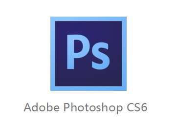
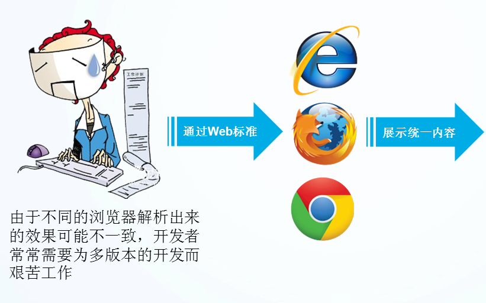
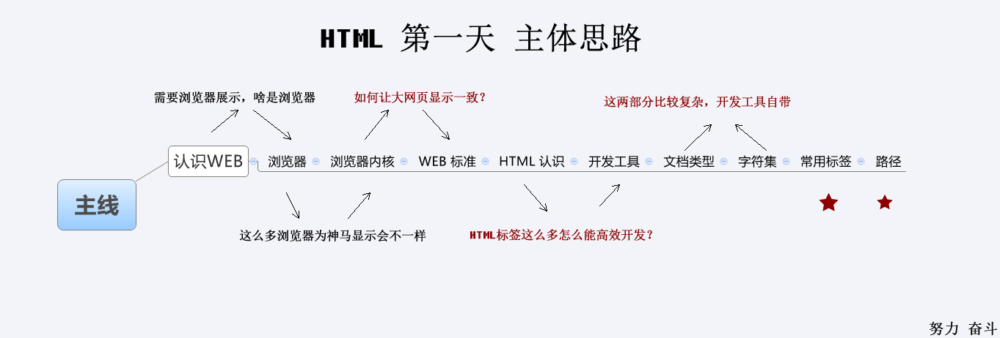

---
 学习目标:

  - 了解常用浏览器
  - 掌握WEB标准
  - 理解标签语义化
  - 掌握常用的排版标签
  - 掌握常用的文本格式化图像链接等标签
  - 掌握三种列表标签
  - 掌握表格标签
  - 掌握表格标签
  - 掌握表单标签
typora-copy-images-to: media

---


# 学习文件夹


# 英文单词

```
code 代码
response  响应
request 请求 
document type  文档类型
language  语言
head 头
body 身体、主题
char 字符
set 设置
name 名
content 内容
keywords 关键词
title 标题
open 打开
browser 浏览器
javascript 
style 样式
navigation 导航
logo 商标
search 搜索
text 文本
decoration 修饰、装饰
none 无，没有
color 颜色
background : 背景
border : 边框
solid : 实心的
dotted : 点
dashed : 虚线
font : 字体
weight : 重量
bold : 加粗
width:宽度
height：高度
italic : 倾斜的
normal ： 正常的
transparent ：透明的
fixed : 固定的
relative : 相对的
absolute:绝对的
position:位置
float : 浮动
left: 左
right:右
center:中间
block :块状的
inline : 行内的
display:显示
family:家庭
size:大小、尺寸
line-height :行高
list: 列表
product :商品
item：列表项、一件商品
login: 登录
register: 注册
logout:登出、退出
site:网站
board : 面板
```


# Typora  和 Visual Studio Code

 

## Typora :   


  word 软件 --->.doc

 Typora 软件 --->.md

  markdown 和 word  类似，是一种安装在操作系统上的应用软件

  word 软件用于读取和新建 doc 文档

 markdown 软件用于读取和新建 md 文档 (md文档主要用于 解释代码的（可以代码文本混排）


例如：


​                类似于 .doc 文档用 word 软件读取


markdown 文档语法？

```
# 这是一级标题
## 这是二级标题
### 这是三级标题
#### 这是四级标题
##### 这是五级标题
###### 这是六级标题
**这是加粗的文字**
*这是倾斜的文字*
***这是斜体加粗的文字***
~~这是加删除线的文字~~
>这是引用的内容
>>这是引用的内容
>>>>>>>>>>这是引用的内容
---   分割线
----  分割线
***   分割线
***** 分割线
- 列表内容
+ 列表内容
* 列表内容

注意：- + * 跟内容之间都要有一个空格

​``` 代码(可以选择语言的类型)
```

**加粗**

*斜体*

***加粗斜体***

~~删除线~~

> 这里是引用的内容
>
> > 二级引用
> >
> > > 三级引用

---

- 水果

  + 苹果
  + 香蕉
  + 大蒜

- 蔬菜

  - 西红柿

  + 番茄
  + 豆腐


- 早餐

  - 鸡蛋饼

    - 鸡蛋

      - 鸡


### github网站：

github网站 :  存放着世界上所有的开源代码

开源： 源代码开放

 闭源：源代码不开放


## Visual Studio Code

### 是什么？

操作系统作用？ 驱动硬件（CPU、显卡、声卡、网卡、外存、内存）

操作系统类型？windows、linux、unix、osx、android、ios、塞班、windows phone

Visual Studio  Code 是安装在操作系统上面的应用软件

### 作用？

是一个代码编辑器，用来写代码的（文本编辑器常用word）

类似**Visual Studio Code**的代码编辑器还有：sublime 、Hbuilder、atom 、webstorm、phpstorm、eclipse


### 来自哪里？

微软开发


# 互联网


## 是什么？

由数量极大的各种`计算机网络`互联起来

诞生在美国

互连网---->互联网

计算机网络早期用于：科研 和 军事


## 互联网标准化

​      标准化有利于促进行业的发展，例如智能手机开始诞生的时候出现了各种各样的充电接口，充电接口的统一有

​      利于促进手机行业的发展，互联网也是一样的

​     互联网的标准化工作对互联网的发展起到了非常重要的作用 。

​     标准化工作 的好坏对一种技术的发展有着很大的影响 。

​     缺乏国际标准将会使技术的发展处于比较混乱的状态，

​    而盲目自由竞争的结果很可能形成多种技术体制并存且互不兼容的状态（如过去形成的彩电三大制式），

​    给用户带来较大的不方便 。   

​    但国际标准的制定又是一个非常复杂的问 题，这里既有很多技术问题 ，也有很多       

​    属于非技术问题 ，如不同厂商之间经济利益的争夺问题等。

   1992 年由于互联网不再归美国政府管辖 ，因此成立了一个国际性组织叫做互联网协会 (Internet Society ，简称

​    为 ISOC) [W-ISOC] ，以便对互联网进行全面管理以及在世界范围内促进其发展和使用 。


## 诞生时间？

    1983年TCP/IP协议成为标准协议，使得所有使用TCP/IP协议的计算机都能利用互连网相互通信，因而人们把1983年
    
    作为互连网诞生的元年


## 影响？
    网络游戏、网上视频、微信聊天、搜索查阅各种信息、电子邮件、网上购物、购买机票火车票、网上订餐、网约车、网
    
    上买卖股票……


## 互联网 +？

    互联网 + 各个传统行业，把互联网的创新成果深度融合于经济社会各个领域之中，
    
    大大提升了实体经济的创新力和生产力
    
    衣（淘宝、京东、唯品会、拼多多）
    食（美团、饿了么）
    住（携程、途牛、去哪）
    行（滴滴、ofo）


## 互联网在我国的发展 ？

截至 2015 年 12 月底，我国网民已达到 6.88 亿，互联网普及率已达到 50.3%

在网民中 ，手机网民的规模己达到 6.20 亿，占总体网民的比例为 90.1% 

当前网民最主要的网络应用就是搜索引擎 ( 即在互联网上使用搜索引擎来查找所需的信息 ） 、即时通信 、网络音

乐 、网络新闻 、 博客等 。

更多的经济活动己步入了互联网时代 。网上购物、网上支付和网上银行的使用率也迅速提升 。

到 2016 年底，我国的国际出口带宽己接近 5.4 Tbit/s (1 Tbit/s = 103 Gbit/s），这里中国电信的CHINANET占有

出口总带宽的近 60%。


## 互联网人物和事件

1996 年，张朝阳创立了中国第一家互联网公司 一 爱特信公司，两年后 ，爱特信公司推出 “搜狐” 产品，并更名为搜狐公司 （Sohu），搜狐公司最主要的产品就是搜狐网站（Sohu.com），是中国首家大型分类查询搜索引擎 。

1997 年，丁磊创立了网易公司 (NetEase），推出了中国第一家中文全文搜索引擎 。网易 公司开发的超大容量免费邮箱 （如 163 和 126 等），由于具有高效的杀毒和拦截垃圾邮件的 功能，邮箱的安全性很好，己成为国内最受欢迎的中文邮箱 。网易网站现在也是全国出名的 综合门户网站 。

1998 年，王志东创立新浪网站（ Sina.com），该网站现己成为全球最大的中文综合门户网 站。新浪的微博是全球使用最多的微博之一 。

1998年11月，马化腾 、张志东创立了腾讯公司（Tencent） 。

1999 年腾讯就推出了用在个人电脑 上的即时通信软件 QICQ，简称为 QQ 。

2000 年，李彦宏和徐勇创建了百度网站（ Baidu.com），现在已成为全球最大的中文搜索引擎。

1999 年，马云创建了阿里巴巴网站，是一个企业对企业的网上贸易市场 平台 。

2003 年，马云创立了个人网上贸易市场平台 一 淘宝网

2004 年，阿里巴巴集团创立了第三方支付平台 一 支付宝（Alipay.com） ，为中国电子商务提供了简单 、 安全、快速的在线支付手段 。现在淘宝网已成为中国最大的 、深受欢迎的网购零售平台 。


**滴滴案例**

2012年7月10日，程维和吴睿、李响一块成立[北京小桔科技有限公司](https://baike.baidu.com/item/%E5%8C%97%E4%BA%AC%E5%B0%8F%E6%A1%94%E7%A7%91%E6%8A%80%E6%9C%89%E9%99%90%E5%85%AC%E5%8F%B8)成立（主要产品有[滴滴打车](https://baike.baidu.com/item/%E6%BB%B4%E6%BB%B4%E6%89%93%E8%BD%A6/5517472)、[滴滴专车](https://baike.baidu.com/item/%E6%BB%B4%E6%BB%B4%E4%B8%93%E8%BD%A6/15491194)、[滴滴快车](https://baike.baidu.com/item/%E6%BB%B4%E6%BB%B4%E5%BF%AB%E8%BD%A6/17564297)等），

2012年12月，滴滴打车获得了A轮金沙江创投300万美元的融资。

2013年4月，完成B轮融资：[腾讯](https://baike.baidu.com/item/%E8%85%BE%E8%AE%AF)集团投资1500万美金。

2014年1月，完成C轮1亿美金融资：中信产业基金6000万美金、腾讯集团3000万美金、其他机构1000万美金

2014年12月，完成D轮7亿美金融资，由国际知名投资机构淡马锡、国际投资集团DST、腾讯主导投资

2016年5月13日，滴滴出行宣布其最新一轮融资取得重要进展，获得多家海内外知名金融及产业机构支持。其

中，[Apple](https://baike.baidu.com/item/Apple/3860362)以10亿美元投资本轮，是滴滴迄今为止获得的单笔最大投资。通过此次投资，Apple与腾讯、阿里巴巴

等一起成为滴滴战略投资者。

2018年9月8日23点至9月15日凌晨5点期间在中国大陆地区暂停提供深夜23:00-5:00时间段的出租车、快车、优

步、优享、拼车、专车、豪华车服务。


# 计算机之间通讯方式？

计算机之间通讯方式分为两种：1. 客户、服务器方式     2.  对等连接方式


## 1、客户一服务器方式    


这种方式在互联网上是最常用的 ，也是传统的方式 。

我们在上网时 ，都是使用客户一服务器方式    

客户（client）和服务器（server）都是指通信中所涉及的两个**应用进程** （软件）。

客户--服务器方式所 描述的是进程之间服务和被服务的关系 


​     

1、在浏览器地址栏输入 www.baidu.com 敲回车

2、浏览器会向百度服务器发送网络请求，请求百度首页

3、百度服务器会对我的浏览器做出响应，将百度首页推送到我的浏览器

4、浏览器解析百度首页


PC（personal computer）

#### 客户一服务器方式特点 。 

**客户程序：**
​      (1） 被用户调用后运行 ，在通信时主动向远地服务器发起通信  。因此，客户程序必须知道服务

器程序的地址 。

​      常见的客户程序：手机软件（淘宝、京东……）、电脑软件（浏览器、网易云音乐、微信……）

​      (2） 不需要特殊的硬件和很复杂的操作系统 。 

​      客户程序运行在哪些硬件上面？

​      手机、电脑、平板电脑、数字电视

​      客户程序安装在哪些操作系统上？

​      windows、android、ios、塞班 、osx

**服务器程序 ：**

  (1） 是一种专门用来提供某种服务的程序 ，可同时处理多个远地的请求 。

  (2） 系统启动后即自动调用并一直不断地运行着 ，被动地等待并接受来自各地的客户的通信请求 。

  (3） 一般需要有强大的硬件和高级的操作系统支持 。

​        服务器 (云服务器)：        

​        服务器操作系统： linux 

（4） 客户与服务器的通信关系建立后 ，通信可以是双向的 ，客户和服务器都可发送和接收数据。


上面所说的客户和服务器本来都指的是计算机进程 。

在表示机器时 ，我们使用 “ 客户端” 或 “服务器端”  来表示 “运行客户程序的机器” 

或 “运行服务器程序的机器”。

 

**服务器：**

```
   服务器说白了就是一个大型计算机，是一种硬件，通常是指那些具有较高计算能力，能够提供给多个用户使用的计
   
   算机。

   服务器与PC机（personal computer 个人电脑）的不同点很多，
   
   例如：PC机在一个时刻通常只为一个用户服务。PC机直接给用户使用，服务器通过网络为多个pc机提供服务
   
   和普通的PC相比， 服务器需要连续的工作在7X24小时环境中。这就意味着服务器需要更高的性能配置
```


 **客户端：**

     客户端（*Client）或称为用户端，是指与服务器相对应，为客户提供本地服务的程序。除了一些只在本地运行
     
     的应用程序之外，一般安装在普通的客户机上，需要与服务端互相配合运行。

   客户端程序开发？

    App开发（ios系统、android系统）
    
    windows、Mac、Linux系统应用开发
    
    网页开发（基于浏览器）


## 2.  对等连接方式
对等连接 （ peer-to-peer） ，简写为 P2P，是指两台主机在通信时并不区分哪一个是服务请求方哪一个是服务提     
供方 。

只要两台主机都运行了对等连接软件 （P2P 软件），它们就可以 进行平等的 、对等连接通信

在下图中，主机 C, D, E 和 F 都运行了 P2P 软件，因此 这几台主机都可进行对等通信


# 万维网（WWW）

​      

## 是什么？

 WWW是环球信息网的缩写，（亦作“Web”、“WWW”、“'W3'”，英文全称为“World Wide Web”），

中文名字为“万维网”，"环球网"等，常简称为Web。


## 创建时间？

1989年


## 为什么要创建万维网？

互联网为我们提供多种服务：上网、即时通讯、邮件、游戏、网络电视…………

互联网包括万维网，万维网提供了一种容易的方式来获得互联网上交叉引用的文档

万维网的本质：客户与服务器通讯


## HTML?

HTML (Hyper Text Markup Language) 中文译为`超文本标记语言`

HTML 语言作用？编写网页


## 浏览器功能？

1、向服务器发送网络请求（点击超链接、地址栏输入地址敲回车、点击某个按钮）

2、解析和展示下载的网页文档


## URL ？

**英文全称：**(Uniform Resource Locator)

**中文译名：**统一资源定位符

**作用？**标识互联网上某个资源的唯一地址，互联网上的每个文件都有一个唯一的URL

**组成？**


域名 和 IP地址？

一个域名对应着一个ip地址

域名的出现是为了方便记忆

域名系统 (存储IP地址与域名对应关系的数据库)

www.baidu.com     129.20.10.09

www.qq.com          109.56.67.00


## 组成？

     万维网分为Web客户端和Web服务器。
     
     万维网可以让Web客户端（常用浏览器）访问Web服务器上的页面。 
    
     万维网是一个由许多互相链接的网页组成的系统，通过互联网访问。
    
     在这个系统中，每个页面，称为一样“资源”；并且由一个统一资源定位符”（URL）标识；
    
     这些资源通过超文本传输协议 HTTP（Hypertext Transfer Protocol）传送给用户


## 万维网联盟

  万维网联盟（World Wide Web Consortium，简称W3C），又称W3C理事会。

  负责制定各项web标准，1994年10月在麻省理工学院（MIT）计算机科学实验室成立。

  万维网联盟的创建者是万维网的发明者蒂姆·伯纳斯-李。

  万维网并不等同互联网，万维网只是互联网所能提供的服务之一，是靠着互联网运行的一项服务。

  互联网能够提供的服务： 万维网、邮件、数字电视、即时通信

2001~2012 年，腾讯、百度 及 360 先后加入了万维网联盟，共同参与互联网技术标准的研究和制定，

促进了国内互联网产业的发展


# 回顾

```
url  uniform resource locator  同一资源定位符

url 作用 ？  标识互联网上某一资源的地址

www: 万维网

http:超文本传出协议

html:超文本标记语言

html 作用？ 编写网页

计算机之间的通讯方式？

ajax(asynchrous javascript and xml) 使得网页可以和服务器之间进行数据交互

1、客户-服务器方式

2、对等链接方式
```


# 网页开发工具

我们主要用的 开发工具有   chrome(浏览器)  、代码编辑器（Visual Studio Code、sublime、webstorm） 、  photoshop

 **Chrome** : 是由Google开发的一款设计简单、高效的浏览器

**代码编辑器** : 编写代码的工具，网页开发中常见的代码编辑器有 VS、sublime、webstorm、atom、HBuilder


## 浏览器（显示）

```
  
   浏览器是网页显示、运行的平台，
   
   常用的浏览器？
   
   IE、火狐（Firefox）、谷歌（Chrome）、苹果（Safari）、Opera 。我们平时称为五大浏览器。

   Edge 是 windows 10 之后由微软推出的浏览器 ， 而在windows 10 之前微软系统自家浏览器都是IE。

```


各浏览器占有的市场份额（知晓）

查看网站： <a href="http://tongji.baidu.com/data/browser" target="_blank">http://tongji.baidu.com/data/browser</a>


## 代码编辑器（写代码）

 


为VS安装插件？


## Photoshop(协助)



PS 工具是我们使用频率比较高的软件之一， 我们学习PS目的不是为了设计海报做电商和UI的，而是要求：

1. **熟练的切图**
2. 能和网站美工美眉有共同话题。。。。。

如何切图？

利用PS的切片工具

1、将设计图中的小图切下来


2、文件    ----》导出----》 存储为web所用格式 -----》 存储


# 认识网页

```
网页?

主要由文字、图像和超链接等元素构成。当然，除了这些元素，网页中还可以包含音频、视频以及Flash等。
```

**网页与浏览器的关系？**

我们编写的网页代码，最终是通过浏览器进行解析，呈献给用户的


# 常见浏览器内核介绍

```
常用的浏览器有IE、火狐（Firefox）、谷歌（Chrome）、Safari 和 Opera等。我们平

时称为五大浏览器。
```


## 浏览器内核（理解）             

```
浏览器内核是什么？

指浏览器的渲染引擎（浏览器的核心代码）

渲染引擎作用？

读取网页代码，解释成文字、图片、视频、音频、动态效果，呈献给用户

浏览器的内核（渲染引擎）的不同----》网页的语法解释会有不同----》所以渲染的效果也不相同。

浏览器内核分类？

Trident、Gecko、Blink、Webkit。
```

（1）Trident(IE内核) 

国内很多的双核浏览器的其中一核便是 Trident内核，美其名曰 "兼容模式"。

代表： IE、傲游、世界之窗浏览器、Avant、腾讯TT、猎豹安全浏览器、360极速浏览器、百度浏览器等。

Window10 发布后，IE 将其内置浏览器命名为 Edge，Edge 最显著的特点就是新内核 EdgeHTML。

（2）Gecko(firefox) 

Gecko(Firefox 内核)： Mozilla FireFox(火狐浏览器) 采用该内核，Gecko 的特点是代码完全公开，因此，其可开发程度很高，全世界的程序员都可以为其编写代码，增加功能。 可惜这几年已经没落了， 比如 打开速度慢、升级频繁、猪一样的队友flash、神一样的对手chrome。

（3） webkit(Safari)  

 Safari 是苹果公司开发的浏览器，所用浏览器内核的名称是大名鼎鼎的 WebKit。

 现在很多人错误地把 webkit 叫做 chrome内核（即使 chrome内核已经是 blink 了），苹果感觉像被别人抢了媳妇，都哭晕再厕所里面了。

 代表浏览器：傲游浏览器3、 Apple Safari (Mac/iPhone/iPad)、Symbian手机浏览器、Android 默认浏览器，

（4） Chromium/Blink(chrome) 

   在 Chromium 项目中研发 Blink 渲染引擎（即浏览器核心），内置于 Chrome 浏览器之中。Blink 其实是 WebKit 的分支。 

     大部分国产浏览器最新版都采用Blink内核。二次开发

（5） Presto(Opera) 

  Presto（已经废弃） 是挪威产浏览器 opera 的 "前任" 内核，为何说是 "前任"，因为最新的 opera 浏览器早已将

之抛弃从而投入到了谷歌怀抱了。  


### 移动端的浏览器内核

移动端浏览器内核主要是webkit内核


# chrome插件安装

以掘金插件为例


打开如下页面


安装插件

直接将插件拖入浏览器界面


# Web标准（重点）

浏览器内核？浏览器的核心代码，浏览解析网页的规则

浏览器的内核不同，他们的工作原理、解析方式是不同的，同一网页在不同浏览器上显示就会有差别。 




## 浏览器大战

```
   蒂姆·伯纳斯-李是第一个使用超文本来分享资讯的人。他于1990年发明了第一个网页浏览器 WorldWideWeb，后来改名为Nexus。
   
   20世纪90年代初，出现了许多浏览器，浏览器根据gopher和telnet协议，允许所有用户能轻易地浏览别人所编写的网站。可是，其后在浏览器中加插图像的举动，使之成为了互联网的“杀手级应用”。
   
   NCSA Mosaic使互联网得以迅速发展。它最初是一个只在Unix运行的图像浏览器；很快便发展到在Apple Macintosh和Microsoft Windows亦能运行。 1993年9月发表了1.0版本。NCSA中Mosaic项目的负责人Marc Andreesen辞职并建立了网景通讯公司。
    
    网景公司在1994年10月发布了他们的旗舰产品网景导航者。但第二年Netscape的优势就被削弱了。错失了互联网浪潮的微软在这个时候匆促的购入了Spyglass公司的技术，改成Internet Explorer，掀起了软件巨头微软和网景之间的浏览器大战。这同时加快了万维网发展。
    
    这场战争把网络带到了千百万普通电脑用户面前，但同时显露了互联网商业化如何妨碍统一标准的制定。微软和网景都在他们的产品中加入了许多互不相容的HTML扩展代码，试图以这些特点来取胜。1998年，网景公司承认其市场占有率已无法挽回，这场战争便随之而结束。微软能取胜的其中一个因素是它把浏览器与其操作系统一并出售；这亦使它面对反垄断诉讼。
    
    网景公司以开放源代码迎战，创造了Mozilla，但此举未能挽回Netscape的市场占有率。在1998年底微软收购了网景公司。在发展初期，Mozilla计划为着吸引开发者而挣扎；但至2002年，它已发展成一个稳定而强大的互联网套件。Mozilla 1.0的出现被视为其里程碑。同年，衍生出Phoenix（后改名Firebird，最后又改为Firefox）。Firefox 1.0于2004年发表。及至2008年，Mozilla及其衍生产品约占20%网络交通量。
    
    Opera是一个灵巧的浏览器。它发布于1996年。2013年它在手机上十分流行。它在个人电脑网络浏览器市场上的占有率则稍微较小。
    
    Lynx浏览器仍然是Linux市场上十分流行的浏览器。它是全文字模式的浏览器，视觉上并不讨好。还有一些有着进阶功能的同类型浏览器，例如Links和它的分支ELinks。 
```

```
微软浏览器的发展

   2003年，微软宣布不会再推出独立的IE，但会变成视窗平台的一部分；同时也不会再推出任何Macintosh版本的IE。不过，于2005年初，微软却改变了计划，并宣布将会为Windows XP、Windows Server 2003和Windows Vista操作系统推出IE7。
   
   2011年3月15日，微软推出了IE9的正式版，值得一提的是，IE9不再支持Windows XP。微软官方表示，IE9不支持WindowsXP是因为其硬件加速功能在WindowsXP系统上无法正常运行。而windows7要求电脑内存至少在1G以上。对此，微软大中华区开发工具及平台事业部总经理谢恩伟表示，“建议这部分用户使用IE8。”
   
   2011年4月11日，IE9才推出1个月，微软又推出了IE10的首个预览版本。IE9不支持XP让不少用户感到愤怒
   
   据协议描述，IE10将只支持Windows 7 、Windows 8 两个版本，不过好在Windows Vista从开始到结束都是
   
   一个悲情故事，IE10不支持Windows Vista对于这么点用户数量而言实在是很难引起反弹的
   
   2015年4月30日，微软在旧金山举行的Build 2015开发者大会上宣布，其最新操作系统——Windows 10内置代号
   
   为“Project Spartan”的新浏览器被正式命名为“Microsoft Edge”，其内置于Windows 10版本中。
   
```

## 为什么要指定web标准？

        我们大部分人都有深刻体验，每当主流浏览器版本的升级，我们刚建立的网站就可能变得过时，我们就需要升级或
            
        者重新建造一遍网站。
        
        例如1996-1999年典型的"浏览器大战"，为了兼容Netscape和IE，网站开发者不得不为
        
        这两种浏览器写不同的代码。同样的，每当新的网络技术和交互设备的出现，我们也需要制作一个新版本来支持这
        
        种新技术或新设备。类似的问题举不胜举：网站代码臃肿、繁杂浪费了我们大量的带宽；针对某种浏览器的特效，
        
        屏蔽了部分潜在的客户；不易用的代码，残障人士无法浏览网站等等。这是一种恶性循环，是一种巨大的浪费。 
        
       如何解决这些问题呢？有识之士早已开始思考，需要建立一种普遍认同的标准来结束这种无序和混乱。
       
       商业公司  
       (Netscape、Microsoft等)也终于认识到统一标准的好处，因此在**W3C**（万维网联盟创建于1994年，是
       
       Web技术领域最具权威和影响力的国际中立性技术标准机构）的组织下，网站标准开始被建立（1998年2月10日发
       
       布XML1.0为标志），并在网站标准组织（webstandards.org）的督促下推广执行。 
    
        简单说，建立网站标准的目的就是： 提供最多利益给最多的网站用户，确保任何网站文档都能够长期有效，简化
        
        代码、降低建设成本让网站更容易使用，当浏览器版本更新，或者出现新的网络交互设备时，确保所有应用能够继
        
        续正确执行


## 采用Web标准的好处 

**对网站浏览者的好处：** 

       1、文件下载与页面显示速度更快； 内容能被更多的用户所访问（包括失明、视弱、色盲等残障人士）；
    
       2、内容能被更广泛的设备所访问（包括屏幕阅读机、手持设备等等）
    
       3、用户能够通过样式选择定制自己的表现界面 

**对网站开发者的好处：** 

      1、更少的代码和组件，容易维护，成本降低。举个例子：当 ESPN.com 使用 CSS改版后，每天节约超过两兆字节（terabytes）的带宽。
    
      2、更容易被搜寻引擎搜索到
    
      3、改版方便，不需要变动页面内容， 提高网站易用性。


##  Web 标准构成

 Web标准不是某一个标准，而是由W3C和其他标准化组织制定的一系列标准的集合。

主要包括结构（Structure）、表现（Presentation）和行为（Behavior）三个方面。

~~~
结构标准：结构----HTML。

表现标准：样式-----CSS。

行为标准：行为-----Javascript
~~~

理想状态我们的源码： .HTML    .css   .js 

小米官网例子：


直观感受：


总结WEB标准：

结构标准：     决定你是否有个好天然身体 


表现标准：     决定你是否打扮的美丽外观


行为标准：     决定你是否有吸引人的行为


## 课堂一练：

**1.关于WEB标准下列说法正确的是: **

A html决定页面的行为，css决定页面的样式，js决定页面的结构

B html决定页面的样式，css决定页面的结构，js决定页面的行为

C html决定页面的结构，css决定页面的样式，js决定页面的行为

D 以上都不正确

2 **web 标准里边规定三层分离不包括哪部分**

A．HTML

B．CSS

C．JavaScript

D．PHP

3.**关于WEB标准下列说法正确的是**

A．html相当于人的动作行为，CSS相当于人的穿着打扮，javascript相当于人的骨架结构；

B．html相当于人的骨架结构，CSS相当于人的穿着打扮，javascript相当于人的动作行为；

C．html相当于人的穿着打扮，CSS相当于人的骨架结构，javascript相当于人的动作行为；

D．html相当于人的骨架结构，CSS相当于人的动作行为，javascript相当于人的穿着打扮；


# HTML 初识


浏览器能够解析的语言 ：HTML(骨架)、CSS（样式）、Javascript（行为,扎哇死可瑞破）


## HTML简介

 ```
超文本标记语言（英文缩写：HTML）是为 “创建网页” 设计的一种标记语言

万维网上的一个超文本文档称之为一个页面。

在万维网上放置开始点的页面称为主页或首页，

主页中通常包括有指向其他相关页面的超链接，

所谓超级链接，就是统一资源定位符（Uniform Resource Locator，外语缩写：URL），

通过点击它，可使浏览器方便地获取新的网页。这也是HTML获得广泛应用的最重要的原因之一。

在逻辑上将视为一个整体的一系列页面的有机集合称为网站（Website或Site）。

网页的本质就是超文本标记语言，通过结合使用其他的Web技术，可以创造出功能强大的网页。

因而，超级文本标记语言是万维网编程的基础，也就是说万维网是建立在超文本基础之上的。

 ```

```
超文本标记语言（第一版）——在1993年6月作为互联网工程工作小组（IETF）工作草案发布（并非标准）：

HTML 2.0——1995年11月作为RFC 1866发布，在RFC 2854于2000年6月发布之后被宣布已经过时

HTML 3.2——1997年1月14日，W3C推荐标准

HTML 4.0——1997年12月18日，W3C推荐标准

HTML 4.01（微小改进）——1999年12月24日，W3C推荐标准

HTML 5 —— 2014年10月28日，W3C推荐标准
```

```html
<!DOCTYPE html>  作用 ？ 

html5的文档类型声明

<!DOCTYPE HTML PUBLIC "-//W3C//DTD HTML 4.01 Transitional//EN"> 作用 ？

html4.01的文档类型声明

html 与 html5 的区别和联系？

html 是超文本标记语言，万维网编程的基础

html5 是html 的最新版本
```


HTML（英文Hyper Text Markup Language的缩写）中文译为“超文本标记语言”。是用来描述网页的一种语言。

所谓超文本，因为它可以加入图片、声音、动画、多媒体等内容，不仅如此，它还可以从一个文件跳转到另一个文

件，与世界各地主机的文件连接。


## 第一个页面

日常生活的书信，我们要遵循共同的约定。 


### HTML基本骨架

```html

<!DOCTYPE html>
<html lang="en">
    
<head>
    <meta charset="UTF-8">    
    <title>Document</title>
</head>
    
<body>	
</body>
    
</html>
```


### 代码格式化？

让代码看起来好看且舒服的过程

VS 中代码格式化的快捷键是 ctrl+s


## 标签（Tags）？


 用于分割内容

  html语言不区分大小写

<html> = <HTML> = <hTmL>

推荐统一使用小写

忽略空白 (空格、 换行)（多个空格会解析成一个空格，换行会视为一个空格）


## 标签属性（attributes）

标签的属性就是标签的特性 （比如手机的颜色是红色）

使用HTML制作网页时，如果想让HTML标签提供更多的信息，可以使用HTML标签的属性加以设置。

其基本语法格式如下：

    <标签名 属性1="属性值1" 属性2="属性值2" …> 内容 </标签名>

在上面的语法中，

1.标签可以拥有多个属性，必须写在开始标签中，位于标签名后面。

2.属性之间不分先后顺序，不同属性值之间用空格分开。

```html
 <p class="box1 box2"></p>

 属性： class

 class 属性对应的值 ： box1 和 box2

 box1 和 box2 之间用空格隔开

```

3.任何标签的属性都有默认值，省略该属性则取默认值。


 ```html
    <ul type='square'>
        <li>列表项1</li>
        <li>列表项2</li>
        <li>列表项3</li>
        <li>列表项4</li>
        <li>列表项5</li>
    </ul>

type 属性有三个值： disc（实心圆） circle（空心圆） square（实心小方框） 

type 属性的默认值是  disc

 ```


属性值包含在引号（单引号双引号都可以）中。只有一个属性值时，则可以不用引号。

推荐使用引号，且是双引号

### 通用属性和私有属性

通用属性：很多标签都共有的属性（ id ,  class , style）

```html
id : 标签的身份证（id值不能重复），标签的唯一标识

<a id='a1'></a>
<a id='a1'></a>

以上代码时错误的

class : 类（几个标签有共同特性，我们一般给相同的类名）

<a class="link">a1</a>
<a class="link">a2</a>
<a class="link">a3</a>

style : 样式一般写在style属性中

<a style='color:green'>a4</a>
```

私有属性（某个标签所特有的属性）：例如 a 标签的 href


## HTML标签分类

  在HTML页面中，带有“< >”符号的元素被称为HTML标签，如上面提到的 &lt;HTML&gt;、&lt;head&gt;、&lt;body&gt;都是HTML

骨架结构标签。

1.双标签

~~~html
<标签名> 内容 </标签名>
~~~

该语法中“<标签名>”表示该标签的作用开始，一般称为“开始标签（start tag）”，

标签属性一般写在 ‘ 开始标签中’

“</标签名>” 表示该标签的作用结束，一般称为“结束标签（end tag）”。

和开始标签相比，结束标签只是在前面加了一个关闭符“/”。

> ~~~html
> 比如 <body>我是文字  </body>
> ~~~

2.单标签

~~~html
<标签名 />
~~~

  单标签也称空标签，是指用一个标签符号即可完整地描述某个功能的标签。

> ~~~html
> 比如  <br />  强制换行
> ~~~


## HTML标签关系

标签的相互关系就分为两种：

1.嵌套关系

```html
<head>  <title> </title>  </head>
```


2.并列关系

```html
head与body标签就是一种并列关系

<html>
    <head>
        
    </head>
    <body>
        
    </body>
</html>
```


倡议： 

如果两个标签之间的关系是嵌套关系，子元素最好缩进一个tab键的身位。

如果是并列关系，最好上下对齐。

双标签不能交叉，例如出现下面的情况

```html
 <head><title></head></title>
```


## 课堂一练


```
请问下列哪个标签是错误的？
```

```
A  <head></head><body></body>
```

```
B  <strong><div></div></strong>
```

```
C  <head><title></head></title>
```

```
D  <body><div></div></body>
```


# 文档类型声明

浏览器解析 HTML文档时会遵循指定的类型声明标准

HTML4 的规范中定义了多个规范的文档声明，如下是一个典型的使用示例

~~~html
<!DOCTYPE HTML PUBLIC "-//W3C//DTD HTML 4.01 Transitional//EN">
~~~

在HTML5的规范中简化了文档类型声明，省略了DTD的引用，表明文档以标准模式解析

```html
<!DTDTYPE html>

这句话就是告诉浏览器网页使用哪个html版本，  这里使用的是 html 5 的版本
```

```html
<!DOCTYPE> 标签位于文档的最前面，用于向浏览器说明当前文档使用哪种 HTML 或 XHTML 标准规范，
```

注意：  一些老网站可能用的还是老版本的文档类型比如 XHTML之类的，但是我们学的是HTML5,

而且HTML5的文档类型兼容很好(向下兼容的原则)，所以大家放心的使用HTML5的文档类型就好了。


# meta 标签

meta 标签放置在html页面的head中，主要用于**标识网站**， meta标签包含了一些网站的**描述信息**，

如简介、作者等，这些信息**有助于搜索引擎更准确的识别网页**

按照W3C的标准介绍，meta元素有4个属性：name、http-equiv 、content 和 charset

name 属性来表述页面文档的元信息

http-equiv属性设置HTTP请求命令

charset 来设置页面的字符编码

```html

<!-- 声明文档的编码格式 -->

<meta charset="UTF-8">

<!--
   IE 的低版本浏览器很多不遵循W3C标准

   Chrome 浏览器遵循W3C标准

   例如：
    
    W3C 标准规定设置字体颜色 ： color : ……

    低版本 IE 内置的字体颜色解析规则是  ：font-color : ……

    Chrome   内置的字体颜色解析规则是  ：color : ……

    

   设置 chrome=1 时 ， 则会在 IE9及以下浏览器中激活 Chrome Frame ，强制 IE

  使用 Chrome Frame 渲染页面
   
-->

<meta http-equiv="X-UA-Compatible" content="chrome=1">

<!-- 
   keywords 和 description 两个的使用率最高，是搜索引擎优化的主要手段

   设置keywords和 description 这两个 meta  时，尽量使用简洁和语义明确的词语  

-->

<meta keywords='小米官网，小米手机，小米电器'>

<meta content='小米商城直营小米公司旗下所有产品，囊括小米手机系列小米MIX 3、小米8、小米Note 3，红米手机系列红米5 Plus、红米6 Pro，智能硬件，配件及小米生活周边，同时提供小米客户服务及售后支持'>

<!-- 移动设备的兼容代码 -->

<meta name="viewport" content="width=device-width, initial-scale=1.0,maximum-scale=1">
```


# 字符集

## 字符集

字符(Character)是各种文字和符号的总称，包括各个国家文字、标点符号、图形符号、数字等。

字符集(Character set)是多个字符的集合，

字符集种类较多，每个字符集包含的字符个数不同，

常见字符集名称：UTF-8字符集、ASCII字符集、GB2312字符集、BIG5字符集、 GB18030字符集、Unicode字符集等。

计算机要准确的处理各种字符集文字，需要进行字符编码，以便计算机能够识别和存储各种文字。


## 字符编码

在显示器上看见的文字、图片等信息在电脑里面其实并不是我们看见的样子，

即使你知道所有信息都存储在硬盘里，把它拆开也看不见里面有任何东西，只有些盘片。

假设，你用显微镜把盘片放大，会看见盘片表面凹凸不平，凸起的地方被磁化，凹的地方是没有被磁化；

凸起的地方代表数字1，凹的地方代表数字0。

硬盘只能用0和1来表示所有文字、图片等信息。

那么字母”A”在硬盘上是如何存储的呢？

可能小张计算机存储字母”A”是1100001，

而小王存储字母”A”是11000010，

这样双方交换信息时就会误解。

比如小张把1100001发送给小王，小王并不认为1100001是字母”A”，可能认为这是字母”X”，于是小王在用

记事本访问存储在硬盘上的1100001时，在屏幕上显示的就是字母”X”。

也就是说，小张和小王使用了不同的编码表。

小张用的编码表是ASCII，ASCII编码表把26个字母都一一的对应到2进制1和0上；

小王用的编码表可能是EBCDIC,

只不过EBCDIC编码与ASCII编码中的字母和01的对应关系不同


## UTF-8编码


UTF-8（8-bit Unicode Transformation Format）?

```
是一种字符编码方案，又称万国码，由Ken Thompson于1992年创建。

UTF-8用1到6个字节编码字符。

用在网页上可以统一页面显示中文及其它语言（如英文，日文，韩文）。

utf-8是目前最常用的字符集编码方式，常用的字符集编码方式还有gbk和gb2312。

gb2312 简单中文  包括6763个汉字

BIG5   繁体中文 港澳台等用

GBK包含全部中文字符,是GB2312的扩展，加入对繁体字的支持，兼容GB2312

UTF-8则包含全世界所有国家需要用到的字符

记住一点，以后我们统统使用UTF-8 字符集, 这样就避免出现字符集不统一而引起乱码的情况了。

```


# HTML常用标签

 HTML标签有很多，这里我们学习最为常用的，后面有些较少用的，我们可以查下手册就可以了。 

### 标题标签 (熟记)

 单词缩写：  head   头部. 标题

为了使网页更具有语义化，我们经常会在页面中用到标题标签，HTML提供了6个等级的标题，即

```
 <h1>、<h2>、<h3>、<h4>、<h5>和<h6>
```


~~~
h1~h6标题标签 ，依据重要性递减

h1：一级标题
h2：二级标题
h3：三级标题
h4：四级标题
h5：五级标题
h6：六级标题

~~~

其基本语法格式如下：

```html
<hn>   标题文本   </hn>
```


> 注意：  h1 标签因为重要，尽量少用，不要动不动就扔一个h1。
>
>  一般h1 都是给logo使用，或者页面中最重要标题信息。
>
> 页面中h1标签只能有一个

  


注意

```
1、按照HTML标签语义化的原则，在页面内容标题部分应该使用 h1~h6 标签

2、h1 表示页面内容最高层级的标题，为了避免不必要的混淆，每个页面只能有一个h1 标签

   因为大部分搜索引擎会给予页面 h1 标签最高权重
   
3、h1 ~ h6 标签使用过程中不要跳级

4、把不在页面中显示的标题隐藏，而不是删除


```


### 段落标签( 熟记)

 单词缩写：  paragraph 

 在网页中要把文字有条理地显示出来，离不开段落标签，

 就如同我们平常写文章一样，整个网页也可以分为若干个段落

~~~html
<p>  文本内容  </p>
~~~

P标签是HTML文档中最常见的标签

### 水平线标签(认识)

单词缩写：  horizontal  横线    [ˌhɔrəˈzɑntl]    同上

在网页中常常看到一些水平线将段落与段落之间隔开，使得文档结构清晰，层次分明。

<hr />就是创建横跨网页水平线的标签。其基本语法格式如下：

```html
<hr />
```

 在网页中显示默认样式的水平线。

课堂练习2：    新闻页面 

 


### 换行标签(熟记)

单词缩写：  break   打断 ,换行

在HTML中，一个段落中的文字会从左到右依次排列，直到浏览器窗口的右端，然后自动换行。如果希望某段文本

强制换行显示，就需要使用换行标签

```html
<br />
```

这时如果还像在word中直接敲回车键换行就不起作用了。


**课堂一练**

1、关于标签下列说法正确的是 

```html
(A) p1 是段落标签

(B) h1 是标题标签

(C) hr  是换行标签

(D) br  是一条直线

(E) h1 在页面中可以出现多次

（F）h1~h6 权重一次升高

（G) p 和 h1~h6 都是块状元素

（H）行内元素独占一行

 (I) a 是块状元素

（J）h1~h6、p、a 都是块状元素

 （K）块状元素不独占一行

```

 2、 关于标签下列说法不正确的是

```html
(A) H标签有6个等级分别是<h1> <h2> <h3> <h4> <h5>和<h6>

(B) h1到h6 文字从小到大 

(C) p标签独占一行

(D) P是段落标签会给文字加上段落的语义

(E) 使用有语义的标签有利于搜索引擎优化

(F) 搜索引擎爬虫只会爬取网页的head部分
 
(G) p 和 h1~h6 都是有语义的标签
```


### div  span标签(重点)

div  span    是没有语义的，是我们网页布局**主要的2个盒子**     


div 就是  division  的缩写，分割， 分区的意思 

span, 跨度，跨距；   

语法格式：

~~~html
<div> 这是头部 </div>    <span>今日价格</span>
~~~

练习1

下列说法正确的是：

```HTML
A 、div 、p、h1~h6、span 都是有语义的标签

B、 div 和 span 都是行内元素

C、网页布局的两个主要盒子是span 和 div

D、<span><div></div></span> 这种嵌套方式是合理的

E、<div class='nav-header' id='nav-btn'></div> class 和 id 的命名是符合规范的

  （class 命名用中划线-  ， id 命名用下划线 _ ） 
```


## 文本标签(熟记)

在网页中，有时需要为文字设置粗体、斜体或下划线效果，这时就需要用到HTML中的文本标签，使文字以特殊的

方式显示。


  b  i  s  u   只有使用 没有 强调的意思       strong   em  del   ins  语义更强烈

推荐使用更具有语义的标签

```html
<!--不推荐代码：无语义的标签，单纯设置样式-->
<b>don't use it</b>
<i>don't use it</i>
<s>don't use it</s>
<u>don't use it</u>

<!-- 推荐代码：使用具有语义的标签，如果单纯为了样式，则应该通过CSS来设置-->
<strong>important</strong>
<em>emphasize</em>
<del>deleted</del>
<ins>insert</ins>
```


推荐用 CSS 控制标签的样式，而不是使用自带样式的标签（em、strong、ins、del）

W3C 标准推荐 结构（html）、样式(CSS)、行为 ( javascript )  三者**分离**

```html
下面代码实现了样式和结构的分离

<span class='span-bold'>span</span>

.span-bold {
    font-weight: bold
}

下面代码没有实现样式和结构的分离

<span style='font-weight:bold'></span>

```


**html 标签对应的英文**

```
标签	对应英文	说明
<!-->	/	注释
<!DOCTYPE>	document type	文档类型
<a>	anchor	超链接
<abbr>	abbreviation	缩写词
<acronym>	acronym	缩写词
<address>	address	联系信息
<applet>	applet	/
<area>	area	定义图像映射中的区域
<article>	article	文章
<aside>	aside	旁注
<audio>	audio	音频
<b>	bold	加粗
<base>	base	指定链接的默认(基准)地址或默认(基准)目标
<basefont>	base font	指定默认(基准)字体
<bdi>	BiDi-Isolate	双向隔离文本的方向
<bdo>	BiDirectional Override	双向覆盖文本的方向
<big>	big	大号文本
<blockquote>	block quote	块引用
<body>	body	文档主体
<br>	break	换行
<button>	button	按钮
<canvas>	canvas	画布
<caption>	caption	表格标题
<center>	center	居中文本
<cite>	cite	引用
<code>	code	代码文本
<col>	column	表格列
<colgroup>	column group	表格列组
<command>	command	命令
<datalist>	data list	数据列表
<dd>	Definition Description	定义描述
<del>	delete	删除
<details>	details	描述文档或文档某个部分的细节
<dfn>	definition	定义
<dialog>	dialog	对话框
<dir>	direction	方向
<div>	division	部分
<dl>	Definition List	定义列表
<dt>	Definition Term	定义条目
<em>	emphasize	强调
<embed>	embed	嵌入
<fieldset>	field set	表单字段集
<figcaption>	figure caption	figure的标题
<figure>	figure	流内容(图片、图表等)
<font>	font	字体
<footer>	footer	底部
<form>	form	表单
<frame>	frame	框架
<frameset>	frame set	框架集
<h1-h6>	headline	标题
<head>	head	头标签
<header>	header	头部
<hr>	Horizontal Rule	水平线 vertical
<html>	html	html
<i>	italic	斜体
<iframe>	inline frame	内联框架
	image	图片
<input>	input	输入
<ins>	insert	插入
<kbd>	keyboard	键盘文本
<keygen>	keygen	表单的密钥对生成器字段
<label>	label	标注
<legend>	legend	说明
<li>	List Item	列表项
<link>	link	链接
<map>	map	图像映射
<mark>	mark	记号文本
<menu>	menu	菜单列表
<meta>	meta	元信息
<meter>	meter	度量衡
<nav>	navigation	导航
<noframes>	no frames	不支持框架的用户的替代内容
<noscript>	no script	不支持客户端脚本的用户的替代内容
<object>	object	嵌入对象
<ol>	Ordered List	有序列表
<optgroup>	options group	选项组
<option>	option	选项
<output>	output	输出
<p>	paragraph	段落
<param>	parameter	参数
<pre>	preformatted 	预格式化文本
<progress>	progress	进度
<q>	quote	引用
<rp>	ruby parenthesis	不支持ruby元素时显示的内容
<rt>	ruby text	ruby文本
<ruby>	ruby	旁注标记(注音标示)
<s>	strike	删除线文本
<samp>	sample	样本文本
<script>	script	脚本
<section>	section	部分
<select>	select	下拉列表
<small>	small	小号文本
<source>	source	媒介资源
<span>	span	用来组合文档中的行内元素
<strike>	strike	删除线文本
<strong>	strong	强调文本
<style>	style	样式
<sub>	subscript	下标
<summary>	summary	details元素的标题
<sup>	superscript	上标
<table>	table	表格
<tbody>	table body	表格主体
<td>	table data	表格数据单元格
<textarea>	textarea	文本框
<tfoot>	table footer	表格底部
<th>	table headline	表格标题
<thead>	table head	表格头标签
<time>	time	时间
<title>	title	标题
<tr>	table row	表格行
<track>	track	媒体播放器中的文本轨道
<tt>	typewrite text	打字机文本
<u>	underline	下划线
<ul>	Unordered List	无序列表
<var>	variable	变量
<video>	video	视频
<wbr>	Word BReak	单词换行
```


 

## 图像标签img (重点)


```html
  <!-- 
       img 图片标签
       img 单标签
       src属性 ： 图片的链接地址
       alt属性 ：图片未能加载时显示的文字
       title属性：鼠标悬浮在图片上时显示的文字
       为了对搜索引擎友好，图片一般需要加上alt和title属性
     -->

 
```


图片引入路径问题？？


**1、当网页显示图片时,鼠标滑上图片显示文字描述是以下哪个属性**

(A) 设置alt属性

(B) 设置title属性

(C) 设置href 属性

(D) 设置src 属性

 

**2  在HTML中，使用标签插入图像，下列选项关于的src属性说法正确的是 **

(A) 用来设置图片的格式

(B) 用来设置图片的链接地址

(C) 用来设置鼠标指向图片时显示的文字

(D) 用来设置图片是否能正确显示 


## 路径(重点、难点)


实际工作中，通常新建一个文件夹专门用于存放图像文件，这时再插入图像，就需要采用“路径”的方式来指定图像文件的位置。

根目录  当前目录 

路径可以分为： 相对路径 和 绝对路径

### 相对路径

以引用文件之网页所在位置为参考基础，而建立出的目录路径。称之为相对路径。


```
   
相对路径：当你引用本地图片的时候，会用到相对路径 

同级文件才能互相访问，如果不在同一级，我们需要跳出（../）或者进入(/)

../   跳出某个文件夹
/     进入某个文件夹
./    访问同级文件夹，一般情况下可以省略


```

### 绝对路径

绝对路径以Web站点根目录为参考基础的目录路径。

“D:\web\img\logo.gif”，

或完整的网络地址，

例如:https://cdn2.jianshu.io/assets/web/nav-logo-4c7bbafe27adc892f3046e6978459bac.png


### 课堂一练

1.**在下面结构中，哪种写法可以在index页面引入img.gif**


(A)  		

(B)  

(C) 	

(D) 

 

**2在下面结构中，哪种写法可以在index页面中引入1.jpg**


(A) 		

(B) 

(C) 	

(D) 

 练习三：

实现如下效果：


## 行内元素、块状元素、行内块元素(重点)

```
行内元素（inline）、块状元素(block)、行内块元素(inline-block)

行内元素不独占一行，不支持宽高

行内块元素（ 例如 img 、input、textarea、select），不独占一行，但是支持宽高

块状元素独占一行，支持宽高

- 如何将一个元素变成行内元素？
  + 为元素设置 display:inline
如何将一个元素变成行内块元素？
  + 为元素设置 display:inline-block
如何将一个元素变成块状元素？
  + 为元素设置 display: block

行内块之间存在间隙

如何去掉行内块的间隙呢？为父元素设置font-size:0
```


## 链接标签(重点)

单词缩写：  anchor 的缩写  [ˈæŋkə(r)] 。基本解释 锚, 铁锚 的

在HTML中创建超链接非常简单，只需用标签环绕需要被链接的对象即可，其基本语法格式如下：

```html
<a href="跳转目标" target="目标窗口的弹出方式">文本或图像</a>
```

href：用于指定链接目标的url地址，当为标签应用href属性时，它就具有了超链接的功能。  Hypertext 

Reference的缩写。意思是超文本引用

target：用于指定链接页面的打开方式，其取值有_self和_blank两种，其中_self为默认值，_blank为在新窗口中打开方式。

注意：

1.外部链接 需要添加 http://

2.内部链接 直接链接内部页面名称即可 比如 < a href="index.html"> 首页 </a >

3.如果当时没有确定链接目标时，通常将链接标签的href属性值定义为“#”(即href="#")，表示该链接暂时为一个空链接。

4.不仅可以创建文本超链接，在网页中各种网页元素，如图像、表格、音频、视频等都可以添加超链接。


```html
URL格式:
<a href="protocol://server:port/path/filename.html#anchor"> linked text</a>

绝对URL：
<a href=“/odeet/resources/">Iowa State University Home Page</a>
<a href="http://www.hs.iastate.edu/odeet/resources/WebCT/homepage.php#instructors">More tips for instructors</a>
                                                                                  
相对URL：
<a href="../graphics/usamap.gif">Display USA map</a>
                                
锚链接：
<a href="../lessons/class1.html#section2">Display section 2, lesson 1</a>
                                        
mail链接：
<a href="mailto:embleton@iastate.edu">Send email to Karla Embleton</a>
                                     
打电话链接：
<a href=“tel:13601020000”>打电话 to Karla Embleton</a>
                                     
发短信链接：
<a href=“sms:13601020000”>发短信 to Karla Embleton</a>
```


### 锚点定位 （难点）

通过创建锚点链接，用户能够快速定位到目标内容。

~~~html
使用锚点能够实现页面内的跳转

点击对应的 a 标签，就能够跳转到页面对应的内容 

原理：a 标签的href属性值 === # + 对应跳转目标的id值

<a href='#apple'>apple</a>
<a href='#banana'>banana</a>
<a href='#orange'>orange</a>

<p id='apple'>
    apple is very delicious
</p>
<p id='#banana'>
    banana is very delicious
</p>

<p id='orange'>
    orange is very delicious
</p>

~~~

### base 标签  

base 可以设置整体链接的打开状态   

base 写到  <head>  </head>  之间

把所有的连接 都默认添加 target="_blank"

 


## 课堂一练

 1、在HTML中，关于a标签说法不正确的是（）

(A) a标签可以通过href属性跳转到另外一个页面

(B) a标签可以通过target属性设置是否在新窗口中打开

(C) a标签只能在当前页面设置锚点链接，实现页面内跳转

(D) a标签可以通过href="#"设置一个空链接

2、如果想跳转到当前页面里名为show的锚点，下列写法是正确的

A  < a href=".show">跳转</a>

B < a href="#show">跳转</a>

C < a href=" show">跳转</a>

D < a src=" #show">跳转</a>

 

3如果想跳转到同目录下的名为success.html文件里名为show的锚点，下列写法是正确的

(A) < a href="success.html#show">跳转</a>

(B)  < a href="#show">跳转</a> 

(C)  < a href="success#show">跳转</a>
(D) < a src="success.html#show">跳转</a>

 

## HTML特殊字符编码对照表


## 注释

在HTML中还有一种特殊的标签——注释标签。

如果需要在HTML文档中添加一些便于阅读和理解

但又不需要显示在页面中的注释文字，就需要使用注释标签。其基本语法格式如下：
​        

```html
    <!-- 注释语句 -->   ctrl + /       或者 ctrl +shift + / 
```

注释内容不会显示在浏览器窗口中，但是作为HTML文档内容的一部分，也会被下载到用户的计算机上，查看源代

码时就可以看到。

注释重要性：


 

# 快捷键

+ ！+ enter  ：  构建基础的html骨架

+ 标签名 + tab ：   构建某个标签

+ ctrl + ?    ： 注销代码

+ ctrl + s  ： 保存并格式化代码 

+ ctrl + [  或  ctrl + ]   ：左右移动代码

+ ctrl + F   : 查找与替换

+ ctrl + Z    : 撤销

+ ctrl + A    : 全选

+ ctrl + shift  + N  在新建窗口中打开

+ 多光标编辑 （按住alt,可实现左移，右移，删除，编辑）

+ p*5   

  ```html
  <p></p>
  <p></p>
  <p></p>
  <p></p>
  <p></p>
  ```

+ p{段落}*5

  ```html
  <p>段落</p>
  <p>段落</p>
  <p>段落</p>
  <p>段落</p>
  <p>段落</p>
  ```

+ p{段落$}*5

  ```html
  <p>段落1</p>
  <p>段落2</p>
  <p>段落3</p>
  <p>段落4</p>
  <p>段落5</p>
  ```

+ p.nav ( p标签的类名是nav )

  ```html
  <p class="nav"></p>
  ```

+ p#nav

  ```html
  <p id="nav"></p>
  ```

+ p.nav*5

  ```html
  <p class="nav"></p>
  <p class="nav"></p>
  <p class="nav"></p>
  <p class="nav"></p>
  <p class="nav"></p>
  ```

+ p.nav{段落}*5

  ```html
  <p class="nav">段落</p>
  <p class="nav">段落</p>
  <p class="nav">段落</p>
  <p class="nav">段落</p>
  <p class="nav">段落</p>
  ```

+ p>a

  ```html
  <p><a href=""></a></p>
  ```

+ p>a*5

  ```html
  <p>
      <a href=""></a>
      <a href=""></a>
      <a href=""></a>
      <a href=""></a>
      <a href=""></a>
  </p>
  ```

+ p.nav>a.nav-item*5

  ```html
  <p class="nav">
      <a href="" class="nav-item"></a>
      <a href="" class="nav-item"></a>
      <a href="" class="nav-item"></a>
      <a href="" class="nav-item"></a>
      <a href="" class="nav-item"></a>
  </p>
  ```

+ p.nav > a{导航项}.nav-item*5

  ```html
  <p class="nav">
      <a href="" class="nav-item">导航项</a>
      <a href="" class="nav-item">导航项</a>
      <a href="" class="nav-item">导航项</a>
      <a href="" class="nav-item">导航项</a>
      <a href="" class="nav-item">导航项</a>
  </p>
  ```


# 总结

  每一天都有一个主题 我们HTML第一天的主题就是 <认识标签>


总结今天的思路贯穿线：




已学标签

块状标签：p、h1~h6、div、hr、br

行内标签：a、span、b、strong、i、em、s、del、u 、ins

行内块标签：img

语义化标签：strong \ em \ del \ ins \ p \ h1~h6

经常用到的没有语义的盒子：div span

所有标签都是盒子


# 列表标签

什么是列表？


## 无序列表 ul （重点）

无序列表的各个列表项之间没有顺序级别之分，是并列的。其基本语法格式如下：

```html
快捷键： ul>li{列表项$}*3
<ul type='square'>
  <li>列表项1</li>
  <li>列表项2</li>
  <li>列表项3</li>
</ul>

一般不会通过标签的属性来控制标签的样式


```


比如下面这些，新闻是没有顺序的，不用排队。


脚下留心：

```html
 1. <ul></ul>中只能嵌套<li></li>，直接在<ul></ul>标签中输入其他标签或者文字的做法是不被允许的。
 
写法A如下：

 <ul>
     <li>无序列表</li>
</ul>

或
 <ul>
     <li> 
         <ul>
           <li>无序列表</li>
         </ul>
     </li>
</ul>

写法B如下：

<ul>
    无序列表
</ul>

写法A正确，写法B不正确

ul要配合li使用（不能单独使用）

ul、li 都是块状标签（因为他们独占一行）

 
 2. <li>与</li>之间相当于一个容器，可以容纳所有元素。

 
 3. 无序列表会带有自己样式属性,但是我们不这样做，我们一般将样式写在css中

    也就是不要通过标签属性去控制标签的样式

    要通过CSS控制标签的样式
    
   例如 
   
   标签属性控制样式

   <ul type='square'>
       
   </ul>

    css控制样式

    ul{
      list-style:square
    }
```


## 有序列表 ol （了解）


有序列表即为有排列顺序的列表，其各个列表项按照一定的顺序排列定义，有序列表的基本语法格式如下：

```html
<ol>
  <li>列表项1</li>
  <li>列表项2</li>
  <li>列表项3</li>
  ......
</ol>
```

  所有特性基本与ul 一致。  

  但是实际工作中， 较少用 


## 自定义列表（dl dt dd）

定义列表常用于对术语或名词进行解释和描述，自定义列表的列表项前没有任何项目符号。其基本语法如下：

```html
<dl>
  <dt>名词1</dt>
  <dd>名词1解释1</dd>
  <dd>名词1解释2</dd>
  ...
  <dt>名词2</dt>
  <dd>名词2解释1</dd>
  <dd>名词2解释2</dd>
  ...
</dl>
```

  


用的还可以：


# 标签之间的嵌套

  ## 块状元素可以嵌套行内元素 

例如 ： <li><a></a></li>

 ## 行内元素不能嵌套块状元素

 例如不能写成 ：

```html
 <a><li></li></a>
```


## 行内元素可以嵌套行内元素

 例如 ：

```css
<span>
   <i class='apple'>苹果</i>
   <em class='description'>好吃</em>
</span>

对应的css 

    i,em{
       font-style:normal/italic
    }
    .apple{
        font-size:14px
    }
    .description{
        font-size:20px;
        color:red;
        font-weight:bold 
    }
```


​    


## 块状元素可以嵌套块状元素么？

 大部分情况下可以， 例如 

    <div>
       <div></div>
       <p></p>
    </div>

  不可以的情况：例如

```html
<p>
    <div></div>
</p> 

<h1>
    <div></div>
</h1>

<p>
    <p></p>
</p>

p 和 h1~h6 标签 里面一般不会放入块状标签，但是可以放入行内标签
```


  <p>
      <a></a>
  </p>
## 行内元素可以嵌套行内块元素么？

```html
可以

<a href='http://www.baidu.com'>
    
</a>

```


# 表格 table(会使用)

存在即是合理的。  表格现在还是较为常用的一种标签，但不是用来布局，常见处理、显示表格数据。


## 创建表格

在HTML网页中，要想创建表格，就需要使用表格相关的标签。创建表格的基本语法格式如下：

```html
<table>
  <tr>
    <td>单元格内的文字</td>
    ...
  </tr>
  ...
</table>
```

在上面的语法中包含三对HTML标签，分别为 &lt;table&gt;</table&gt;、&lt;tr&gt;</tr&gt;、&lt;td&gt;</td&gt;，他们是创建表格的基本标签，缺一不可，下面对他们进行具体地解释


~~~
1.table用于定义一个表格。

2.tr 用于定义表格中的一行，必须嵌套在 table标签中，在 table中包含几对 tr，就有几行表格。

3.td /th：用于定义表格中的单元格，必须嵌套在<tr></tr>标签中，一对 <tr> </tr>中包含几对<td></td>，

就表示该行中有多少列（或多少个单元格）。
~~~

注意：

```
1. <tr></tr>中只能嵌套<td></td>

2. <td></td>标签，他就像一个容器，可以容纳所有的元素
```


## 表格属性


## 表头标签

表头一般位于表格的第一行或第一列，其**文本加粗居中**，

如下图所示，即为设置了表头的表格。设置表头非常简单，

只需用表头标签&lt;th&gt;</th&gt;替代相应的单元格标签&lt;td&gt;</td&gt;即可。

 

## 表格结构（了解）

```
在使用表格进行布局时，可以将表格划分为头部、主体和页脚（页脚因为有兼容性问题，我们不在赘述），具体 如下所示：

<thead></thead>：用于定义表格的头部。

必须位于<table></table> 标签中，一般包含网页的logo和导航等头部信息。


<tbody></tbody>：用于定义表格的主体。

位于<table></table>标签中，一般包含网页中除头部和底部之外的其他内容。

tfoot  表尾
```


## 表格标题

**表格的标题： caption**

**定义和用法**

caption 元素定义表格标题。

```html
<table>
   <caption>我是表格标题</caption>
</table>
```

caption 标签必须紧随 table 标签之后。您只能对每个表格定义一个标题。通常这个标题会被居中于表格之上。

## 合并单元格(难点)

跨行合并：rowspan    跨列合并：colspan

合并单元格的思想：

     将多个内容合并的时候，就会有多余的东西，把它删除。 
     
     例如 把 3个 td 合并成一个， 那就多余了2个，需要删除2个。


# 表单标签(掌握)

现实中的表单，类似我们去银行办理信用卡填写的单子。 如下图


目的是为了收集用户信息。

在我们网页中， 我们也需要跟用户进行交互，收集用户资料，此时也需要表单。

在HTML中，一个完整的表单通常由表单控件（也称为表单元素）、提示信息和表单域3个部分构成。


  表单控件：

       包含了具体的表单功能项，如单行文本输入框、密码输入框、复选框、提交按钮、重置按钮等。
       
       例如：input、checkbox、button等   

  提示信息：

        一个表单中通常还需要包含一些说明性的文字，提示用户进行填写和操作。

  表单域：  

      他相当于一个容器，用来容纳所有的表单控件和提示信息，可以通过他定义处理表单数据所用程序的url地址，以及
      
      数据提交到服务器的方法。如果不定义表单域，表单中的数据就无法传送到后台服务器。

## input 控件(重点)

在上面的语法中，&lt;input /&gt;标签为单标签，type属性为其最基本的属性，其取值有多种，用于指定不同的控件类型。除了type属性之外，&lt;input /&gt;标签还可以定义很多其他的属性，其常用属性如下表所示。


##  label标签(理解)

label 标签为 input 元素定义标注（标签）。

作用：  用于绑定一个表单元素, 当点击label标签的时候, 被绑定的input输入框就会获得输入焦点

如何绑定元素呢？

```html
<form>
    <div>
        <label for="name">姓名</label>
        <input type="text" name="name" id="name" placeholder="请输入姓名">
    </div>
    <div>
        <label for="password">Male</label>
        <input type="password" name="password" id="password" placeholder='请输入密码'>
    </div>
    <div>
        <input type='submit' value='登录'> 
    </div>
</form>

```

## textarea控件(文本域)

如果需要输入大量的信息，就需要用到&lt;textarea&gt;&lt;/textarea&gt;标签。

通过textarea控件可以轻松地创建多行文本输入框，其基本语法格式如下：

```html
<textarea cols="每行中的字符数" rows="显示的行数">
  文本内容
</textarea>
```


## 下拉菜单

使用select控件定义下拉菜单的基本语法格式如下

```html
<select>
  <option>选项1</option>
  <option>选项2</option>
  <option>选项3</option>
  ...
</select>
```

注意：

1. &lt;select&gt;</select&gt;中至少应包含一对&lt;option></option&gt;。
2. 在option 中定义selected =" selected "时，当前项即为默认选中项。

## 表单域

在HTML中，form标签被用于定义表单域，即创建一个表单，以实现用户信息的收集和传递，form中的所有内容都会被提交给服务器。创建表单的基本语法格式如下：

```html
<form action="url地址" method="提交方式" >
  各种表单控件
</form>
```

常用属性：

1. Action
   在表单收集到信息后，需要将信息传递给服务器进行处理，action属性用于指定接收并处理表单数据的服务器程序的url地址。
2. method
   客户端与服务器数据交互方式，其取值为get或post。

注意：  每个表单都应该有自己表单域。

# pre与code


pre 和 code一般用于展示代码

```html
<pre>
  是块元素。<pre>…</pre> 其中内容已经预先完成格式化，不再过滤空格，不再过滤换行符，但是<>仍然要进行特
  
  殊编码。用于展示多行源代码 。
  
<code>
  是行内元素。同样可以用于展示源代码。用于展示一行源代码

```

# 浏览器解析网页的过程？

```
自上而下去读取网页代码

当读取到 link 标签的时候，会发送网络请求，加载 对应的样式表（CSS文件）

会等待样式文件下载完成并解析后，再执行下面的 html 代码

通过上面的分析，我们得到结论，浏览器会先解析css代码，然后再解析html代码，这样是有好处的

好处是当网速慢的时候，不会出现错乱的排列标签，提高用户体验

```


# 浏览器调试

## 打开调试面板？

快捷键:shift+ctrl+I

## 切换到手机端


## 如何选中页面中的元素


# 高可读性的HTML

## HTML语义化

标签语义化的好处？

+ 搜索引擎更容易读懂页面
+ 提高页面代码的可读性

如何实现标签语义化？

+ 少使用div 和 span，多使用语义标签

  语义标签：h1~h6,ul,li,p,em,strong,

  ​                   header,footer,article,section,nav,aside

  ```
  例如：
  列表可以这样写：
  <div>
      <span></span>
      <span></span>
      <span></span>
      <span></span>
      <span></span>
  </div>
  
  但不如这样写：
  <ul>
      <li></li>
      <li></li>
      <li></li>
      <li></li>
      <li></li>
  </ul>
  ```


+ 为图标或者标题，添加一些隐藏文字

  ```
  利用如下方式可以隐藏文字
  
  .hide{
      text-indent:-9999px
  }
  ```

+ 使用：before 伪类实现一些分隔符或横线

+ 给html标签设置必要的属性

  ```html
  
  <a href='……' title=‘’>
  ```


+ 样式结构分离（清除浮动）


## 网页标题层级

1、按照HTML标签语义化的原则，在页面内容标题部分应该使用 h1~h6 标签

2、h1 表示页面内容最高层级的标题，为了避免不必要的混淆，每个页面只能有一个h1 标签

   因为大部分搜索引擎会给予页面 h1 标签最高权重

3、h1 ~ h6 标签使用过程中不要跳级

4、把不在页面中显示的标题隐藏，而不是删除

## 精简HTML代码

+ 删除多余的容器
+ 装饰性的元素使用CSS样式实现（利用:before和:after）

## 重语义，轻显示

HTML5规范中淡化了块状元素和行内元素的定义（display完全能做到）

构建界面是，先考虑语义，再考虑是否符合UI设计

并按照元素的语义重新划分了元素的类型

```HTML
元数据内容：base\link\meta
流式内容：span\div
章节式内容：article\aside\nav\section
标题式内容：h1~h6\hgroup
段落式内容：span\img
嵌入式内容：img\iframe\svg\audio\video\canvas
交互式内容：a\button\select\input
```

规范中规定，流式内容应包含其他内容

HTML5对元素的包含关系也做了淡化（行内元素可以包含块状元素）


# 查文档

经常查阅文档是一个非常好的学习习惯。

W3C :  http://www.w3school.com.cn/

MDN: https://developer.mozilla.org/zh-CN/


